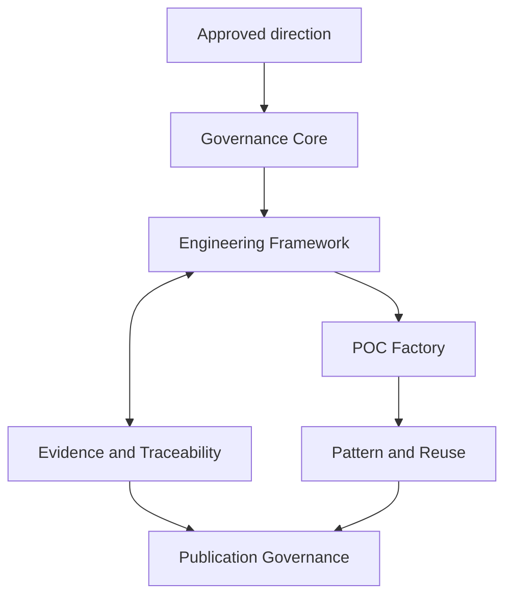

# MBSA Lab OS — System Context and Boundaries

## 1. Purpose

This document defines the system context, responsibilities, trust boundaries, external actors, and principal information flows of MBSA Lab OS.

It establishes an architecture-level contract. It does not claim that every target capability is implemented or operational.

## 2. Scope

### 2.1 In scope

- MBSA Lab OS as the system of interest;
- public engineering governance and lifecycle responsibilities;
- POC, evidence, reuse, and publication responsibilities;
- public/private trust boundaries;
- external actors and capability interfaces;
- high-level artefact and feedback flows;
- architectural assumptions, constraints, and limitations.

### 2.2 Out of scope

- detailed software or infrastructure design;
- selection or implementation of a POC;
- product certification or production deployment;
- internal administration and private operating records;
- detailed design of external platforms or services.

## 3. Terminology

### 3.1 MBSA Lab

MBSA Lab is the broader engineering initiative, including public engineering, future learning, tooling, communication, and community capabilities.

### 3.2 MBSA Lab OS

MBSA Lab OS is the governed engineering operating system of the initiative: the public rules, architecture, lifecycle, evidence, reuse, and publication interfaces used to produce credible engineering results.

### 3.3 MBSA-Lab-OS repository

The repository is the public configuration-controlled representation of MBSA Lab OS. The repository is not the whole system; external actors, private authority, publication platforms, and future tooling remain outside its physical boundary.

### 3.4 Strategic Control

Strategic Control provides direction, priorities, and authority. It is logically shared across public and private concerns. Only approved, publicly suitable direction crosses into the public baseline.

### 3.5 Governance Core

The Governance Core defines engineering rules, decision authority, change control, public/private separation, and baseline acceptance.

### 3.6 Engineering Framework

The Engineering Framework structures work from problem definition through requirements, architecture, safety assessment, implementation, V&V, evidence, and reuse.

## 4. System of interest

The system of interest is the governed public engineering environment that turns approved direction and engineering questions into:

- controlled work products;
- bounded POCs;
- traceable evidence and decisions;
- reusable knowledge where justified;
- authorized public releases.

Its value lies in the coherence and inspectability of these relationships rather than in artefact volume.

## 5. Stakeholders and external actors

| Actor | Interest or interaction |
| --- | --- |
| Maintainer and engineering authority | Direction, architecture, acceptance, and configuration control |
| Systems, software, and safety practitioners | Engineering methods, examples, evidence, and reuse |
| Contributors and reviewers | Proposals, changes, findings, and technical review |
| Learners and educators | Stable public explanations and examples |
| Publication audiences | Accurate, bounded, and traceable communication |
| Private strategic authority | Approved direction and private/public classification |
| Git hosting platform | Public source hosting and collaboration infrastructure |
| Publication platforms | Distribution of approved communication material |
| Future Academy and tooling capabilities | Consumption of stable public engineering assets and feedback |

External platforms remain responsible for their availability, security, terms, and service behaviour.

## 6. System boundary

### 6.1 Inside the MBSA Lab OS boundary

- Governance Core responsibilities;
- Engineering Framework responsibilities;
- Evidence and Traceability responsibilities;
- POC Factory lifecycle and control logic;
- Pattern and Reuse responsibilities;
- public publication-governance rules;
- public repository conventions and baselines.

### 6.2 Outside the boundary

- private strategic and administrative material;
- third-party hosting and publication infrastructure;
- audience-owned systems and accounts;
- future Academy, Eclipse, DSL, plugin, and business implementations;
- production or certification authorities not explicitly established by the project.

### 6.3 Shared or boundary responsibilities

- Strategic Control exchanges approved direction and public feedback;
- Publication Governance exchanges authorized releases and channel status;
- Video Factory consumes approved engineering sources and returns controlled release information;
- contribution interfaces exchange proposals, review findings, and dispositions;
- future tools exchange governed needs, outputs, and evidence.

## 7. Public/private trust boundary

The public repository contains deliberately curated engineering material. Private authority may inform a public decision, but private records are not copied into the public baseline merely to demonstrate process.

Crossing the trust boundary requires:

1. classification and relevance review;
2. removal or replacement of protected information;
3. confirmation of rights and provenance;
4. evidence-bounded claims;
5. publication authority.

Generic engineering concepts remain public when needed to understand the system. Classification is semantic, not a blanket prohibition on terminology.

## 8. Principal interactions

### 8.1 Strategic interaction

Approved direction enters through the Strategic Control boundary. Governance translates it into public scope, priorities, constraints, or decisions.

### 8.2 Engineering interaction

An accepted problem is developed through needs, requirements, architecture, safety assessment, implementation, V&V, evidence, and acceptance.

### 8.3 Contribution interaction

External proposals and findings are classified, assessed for impact, accepted or rejected, and integrated only through controlled change.

### 8.4 Publication interaction

Stable engineering sources are reviewed for technical accuracy, evidence, confidentiality, rights, and channel suitability before release.

### 8.5 Feedback interaction

Audience or operational feedback becomes a governed input. It does not directly alter accepted engineering artefacts.

## 9. Engineering and production capability context

### 9.1 Engineering Framework

Defines the minimal lifecycle and work-product expectations. It is method-led and technology-neutral.

### 9.2 POC Factory

Controls candidate intake, qualification, selection, framing, execution, evidence, publication readiness, learning, and closure. A defined lifecycle does not prove an operational factory.

### 9.3 Pattern Library

Receives pattern candidates and admits reusable patterns only when context, evidence, limitations, and authority are sufficient.

### 9.4 Video Factory

Produces communication projections from approved engineering sources. Video never replaces requirements, V&V results, Evidence Packages, Claims, Findings, or decisions.

## 10. POC candidate context

The current conceptual comparison set is:

- **Emergency Stop Button** — provisional reference candidate for readiness analysis;
- **Door Interlock Safety System** — retained alternative;
- **Overtemperature Protection System** — retained alternative.

Emergency Stop Button is not finally selected and is not authorized to start. Application of the architecture to all three candidates remains conceptual and non-implementing.

## 11. Information and artefact flows

The nominal flows are:

- direction → governed public scope;
- problem → engineering work products → verified evidence;
- accepted POC learning → pattern candidate → admission decision;
- stable sources → publication review → released public artefact;
- feedback → impact assessment → controlled change.

## 12. Boundary classification matrix

| Concern | Classification | Governing rule |
| --- | --- | --- |
| Public engineering documents | Inside/public | Configuration controlled |
| Approved public direction | Shared/public | Crosses through governance |
| Private strategy and administration | Outside/private | Not replicated publicly |
| POC work products | Inside when approved | Maturity and classification explicit |
| Evidence | Inside or restricted | Release depends on authority and rights |
| External channel instance | Outside | Trace to approved release package |
| Future learning/tooling implementation | Outside/future | Consume governed interfaces only |

## 13. Assumptions and constraints

- The repository remains publicly accessible.
- Private strategic authority remains external to the public configuration.
- Architecture is POC-independent and tool-neutral.
- No implementation, safety, or maturity claim exceeds available evidence.
- Traceability is proportional but mandatory for material claims and decisions.
- Publication follows a usable and approved engineering baseline.
- External services may change independently and require boundary adaptation.

## 14. Risks and mitigations

| Risk | Mitigation |
| --- | --- |
| Repository confused with the whole system | Maintain explicit logical and physical boundaries |
| Strategic Control interpreted as one physical component | Treat it as a distributed logical responsibility |
| Maturity inflation | State demonstrated maturity and limitations |
| Confidentiality leakage | Apply semantic classification before release |
| Communication precedes evidence | Require an approved source baseline |
| Tool-driven architecture | Keep capability and interface definitions tool-neutral |
| Architecture specialized to one POC | Compare the three conceptual candidates |

## 15. Limitations

This context model does not allocate detailed software components, define deployment topology, authorize a POC, or demonstrate operational capability. Those conclusions require subsequent architecture, readiness, implementation, and evidence decisions.
