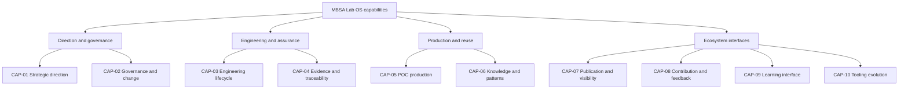
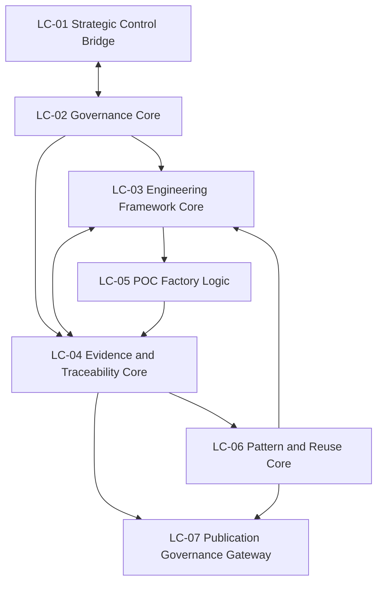

# MBSA Lab OS — Capability and Logical Architecture

## 1. Purpose

This document defines the capability and logical architecture of MBSA Lab OS.

It refines the system context and boundary contract established by
`docs/07_MBSA_Lab_OS_System_Context_and_Boundaries.md` into:

- a stable capability taxonomy;
- a hierarchical capability map;
- a set of cohesive logical components;
- explicit capability-to-component allocations;
- internal, external and shared logical interfaces;
- ownership of information and engineering artefacts;
- logical dependencies and end-to-end flows;
- a controlled public/private trust boundary;
- traceability to upstream sources and downstream Sprint 2 work.

This architecture is technology-independent. It describes what MBSA Lab OS
must be able to do and how logical responsibilities collaborate. It does not
define physical deployment, select tools, prescribe APIs or claim that future
capabilities are operational.

---

## 2. Scope

### 2.1 In scope

This document covers:

- capability taxonomy and decomposition;
- capability purpose, inputs, outputs, dependencies and maturity;
- logical component responsibilities;
- capability-to-component allocation;
- logical ownership of information and artefacts;
- internal and external logical interfaces;
- public/private trust-boundary crossings;
- control, engineering, evidence, reuse and publication flows;
- treatment of open decisions inherited from US011;
- architecture maturity, evidence and limitations;
- traceability to US011 and US013–US020;
- verification of the US012 acceptance criteria.

### 2.2 Out of scope

This document does not:

- define physical or deployment architecture;
- select repositories, databases, protocols, products or vendors;
- define APIs or schemas;
- implement a POC;
- implement the POC Factory or Pattern Library;
- produce the detailed Minimal Engineering Framework of US013;
- define the complete POC Lifecycle of US014;
- replace the evidence, traceability and gate models of US015–US017;
- populate a validated Pattern Library;
- implement the Video Factory or Academy;
- develop Eclipse, Safety DSL or MBSA Plugin capabilities;
- change the boundary classifications established by US011;
- change GitHub visibility;
- modify or expose the private Master Plan;
- start US013–US022.

### 2.3 Architectural level

The architecture is logical and responsibility-oriented.

An allocation in this document means that a logical component is accountable
for a capability or artefact family. It does not imply a process, executable
service, repository, team, tool or deployment unit.

---

## 3. Source Baseline and Authority

### 3.1 Controlled entry baseline

US012 starts from the integrated US011 public baseline:

```text
406595677fe27b33bedee61a7568111368653470
```

Associated integration commit:

```text
Merge US011 - System Context and Boundaries
```

The current functional and merge SHAs for US012 are intentionally not embedded
in this versioned document. They can exist only after the corresponding Git
operations and must be captured in the post-execution US012 status report.

### 3.2 Public authoritative sources

This architecture is derived from:

1. `README.md`;
2. `docs/00_Project_Overview.md`;
3. `docs/01_Vision.md`;
4. `docs/02_Mission.md`;
5. `docs/03_Engineering_Governance.md`;
6. `docs/04_Git_Workflow_and_Versioning.md`;
7. `docs/05_Repository_and_Documentation_Conventions.md`;
8. `docs/06_Sprint_1_Closure_and_Governance_Baseline.md`;
9. `docs/07_MBSA_Lab_OS_System_Context_and_Boundaries.md`.

### 3.3 Authority rule

When two sources express different abstraction levels:

1. the most recent controlled and applicable architecture decision governs;
2. US011 boundary classifications remain authoritative for US012;
3. historical ecosystem views are not interpreted as detailed internal
   allocations;
4. roadmap intent does not prove implementation maturity;
5. public/private classification remains conservative;
6. no historical source is silently rewritten by this document.

### 3.4 Source audit findings

The US012 targeted source audit established:

- nine public sources available at the controlled baseline;
- valid UTF-8 content without BOM or NUL bytes;
- canonical LF line endings in the audited Git archive;
- no blocking semantic contradiction;
- historical status and presentation differences that remain non-blocking when
  interpreted under the US011 authority rule.

---

## 4. Terminology and Modelling Rules

### 4.1 Capability

A **capability** describes what MBSA Lab OS must be able to accomplish to
deliver value. A capability is independent of a specific process, organization,
tool or implementation.

### 4.2 Logical component

A **logical component** is a cohesive responsibility grouping that realizes
one or more capabilities. It owns logical decisions or artefact families but is
not automatically a software component or repository.

### 4.3 Logical interface

A **logical interface** is a governed contract for exchanging information,
artefacts, decisions or evidence between logical components or across the
system boundary.

### 4.4 Logical flow

A **logical flow** is an ordered transformation or circulation of information,
artefacts, decisions or evidence. It is not an implementation sequence.

### 4.5 Artefact ownership

Ownership means accountability for the integrity, state, classification and
governance of an artefact family. It does not necessarily mean physical storage.

### 4.6 Capability, process and component distinction

| Concept | Question answered | Example |
|---|---|---|
| Capability | What must the system be able to do? | Govern controlled change |
| Process | In what order is work performed? | Review, approve, baseline |
| Logical component | Who is logically accountable? | Governance Core |
| Artefact | What information is produced or governed? | Decision record |
| Actor | Who interacts with the system? | Contributor |
| Tool | What technology may support the work? | Git hosting platform |

### 4.7 Controlled identifiers

```text
SRC-US012-nn   Source
DEC-US012-nn   Architecture decision
CAP-nn         Capability
LC-US012-nn    Logical component
IF-US012-nn    Logical interface
FL-US012-nn    Logical flow
A-US012-nn     Assumption
C-US012-nn     Constraint
D-US012-nn     Dependency
R-US012-nn     Risk
AC-US012-nn    Acceptance Criterion
```

---

## 5. Architecture Principles

### AP-US012-01 — Preserve the US011 boundary

Logical decomposition refines the inside of MBSA Lab OS without silently
reclassifying external or shared elements.

### AP-US012-02 — Evidence before maturity claims

No capability becomes operational merely because its target state is described.

### AP-US012-03 — Governance constrains all capabilities

Every engineering, reuse, contribution and publication capability operates
under the Governance Core.

### AP-US012-04 — Traceability is progressive but mandatory

Traceability depth remains proportional to risk and engineering value, while
the chain from source to decision and evidence remains explicit.

### AP-US012-05 — Public/private separation is invariant

Private control content remains outside the public repository. Only approved
direction may cross toward public artefacts.

### AP-US012-06 — Architecture remains technology-independent

Logical responsibilities do not depend unnecessarily on a tool, vendor,
repository structure or hosting platform.

### AP-US012-07 — Reuse follows verification

An artefact may become a reusable pattern only after relevant evidence and
review exist.

### AP-US012-08 — Publication follows controlled evidence

Visibility channels consume approved public artefacts; they do not establish
technical truth.

### AP-US012-09 — Progressive realization

Strategic capabilities may be architected before implementation, provided their
maturity is explicit.

### AP-US012-10 — POC independence

The architecture must support more than the first Emergency Stop Button POC
candidate and must not encode a single demonstration as the whole framework.

---

## 6. Capability Taxonomy

The capability taxonomy contains ten level-1 capabilities.

| ID | Capability | Primary value | Boundary | Maturity |
|---|---|---|---|---|
| CAP-01 | Strategic Direction & Control | Convert strategic intent into governed public direction | BOUNDARY / SHARED | PARTIAL |
| CAP-02 | Governance & Change Control | Preserve controlled decisions, changes and baselines | IN | BASELINED |
| CAP-03 | Engineering Lifecycle Enablement | Structure reproducible engineering work | IN | PARTIAL |
| CAP-04 | Evidence, Assurance & Traceability | Support justified claims and recoverable evidence | IN | PARTIAL |
| CAP-05 | POC Production Enablement | Enable repeatable controlled POC production | IN | STRATEGIC ONLY |
| CAP-06 | Knowledge & Pattern Reuse | Convert verified results into reusable knowledge | IN | STRATEGIC ONLY |
| CAP-07 | Publication & Visibility Governance | Release credible public artefacts deliberately | IN / BOUNDARY | PARTIAL |
| CAP-08 | Contribution & Feedback Integration | Convert external input into controlled change | IN / BOUNDARY | PARTIAL |
| CAP-09 | Learning Interface Enablement | Supply stable assets to future learning capabilities | FUTURE INTERFACE | STRATEGIC ONLY |
| CAP-10 | Tooling Evolution Enablement | Derive tooling needs from recurring proven needs | FUTURE INTERFACE | STRATEGIC ONLY |

### 6.1 Maturity vocabulary

This document uses only the following controlled terms where applicable:

```text
BASELINED
AVAILABLE
PARTIAL
STRATEGIC ONLY
NOT IMPLEMENTED
OPEN DECISION
FROZEN
NOT STARTED
```

`PARTIAL` means that relevant responsibilities or artefacts exist, but the full
operational capability has not been demonstrated.

`STRATEGIC ONLY` means that the target responsibility is recognized but no
operational realization is claimed.

---

## 7. Hierarchical Capability Map



The grouping supports readability. It does not introduce additional components
or organizational silos.

---

## 8. Capability Catalogue

### 8.1 CAP-01 — Strategic Direction & Control

**Purpose:** exchange approved strategic direction and evidence feedback across
the public/private boundary without centralizing private control material in the
public system.

**Inputs:** strategic intent, approved decisions, public evidence, architecture
status and baseline feedback.

**Outputs:** governed public direction, architecture priorities, authorized
scope and decision feedback.

**Dependencies:** CAP-02 and CAP-04.

**Maturity:** `PARTIAL` because public strategic artefacts and private control
exist, while the detailed interaction remains progressively governed.

### 8.2 CAP-02 — Governance & Change Control

**Purpose:** establish work entry, decision, review, change, baseline,
publication and closure discipline.

**Inputs:** authorized scope, proposals, changes, review evidence and acceptance
results.

**Outputs:** decisions, acceptance criteria, baselines, approvals, rejection
rationale and closure status.

**Dependencies:** CAP-01 and CAP-04.

**Maturity:** `BASELINED` through the Sprint 1 Governance Core.

### 8.3 CAP-03 — Engineering Lifecycle Enablement

**Purpose:** organize the technology-independent lifecycle from problem and need
through architecture, implementation, V&V and engineering conclusion.

**Inputs:** governed problem statements, needs, constraints, decisions and prior
knowledge.

**Outputs:** controlled engineering work products, lifecycle state and inputs to
evidence, POC, reuse and publication capabilities.

**Dependencies:** CAP-02 and CAP-04.

**Maturity:** `PARTIAL`; governance exists, but the reusable Minimal Engineering
Framework remains future US013 work.

### 8.4 CAP-04 — Evidence, Assurance & Traceability

**Purpose:** establish relationships between sources, decisions, artefacts,
verification results, acceptance criteria and baselines.

**Inputs:** engineering artefacts, test and review results, decisions, risks and
acceptance criteria.

**Outputs:** evidence links, assurance status, traceability views, limitations
and acceptance demonstrations.

**Dependencies:** CAP-02 and all evidence-producing capabilities.

**Maturity:** `PARTIAL`; evidence rules are baselined, while the detailed model
and package structure remain US015 and US016 work.

### 8.5 CAP-05 — POC Production Enablement

**Purpose:** enable repeatable transformation of a governed engineering concept
into an understandable, verified and publishable demonstration.

**Inputs:** approved POC scope, architecture, lifecycle rules, reusable assets
and acceptance criteria.

**Outputs:** future POC packages, implementation artefacts, V&V evidence and
lessons learned.

**Dependencies:** CAP-02, CAP-03 and CAP-04.

**Maturity:** `STRATEGIC ONLY`; no operational POC Factory is claimed.

### 8.6 CAP-06 — Knowledge & Pattern Reuse

**Purpose:** identify, qualify, baseline and make reusable the knowledge derived
from verified work.

**Inputs:** verified evidence, lessons learned, recurring structures and pattern
candidates.

**Outputs:** reviewed reusable knowledge, future validated patterns and inputs to
engineering, learning and tooling.

**Dependencies:** CAP-04 and CAP-05.

**Maturity:** `STRATEGIC ONLY`; no validated Pattern Library is claimed.

### 8.7 CAP-07 — Publication & Visibility Governance

**Purpose:** ensure that public communication is technically justified,
appropriately classified and derived from stable engineering assets.

**Inputs:** stable public artefacts, evidence, publication candidates,
confidentiality classification and review decisions.

**Outputs:** publication decisions, approved public packages and traceable
handoffs to external channels.

**Dependencies:** CAP-02 and CAP-04.

**Maturity:** `PARTIAL`; publication governance exists, while the complete
multi-channel production system is not implemented.

### 8.8 CAP-08 — Contribution & Feedback Integration

**Purpose:** receive proposals, defects, reviews and feedback and transform them
into governed decisions or controlled changes.

**Inputs:** issues, proposals, review comments, POC results, audience feedback
and clarification needs.

**Outputs:** classified work items, decisions, requested changes, rejection
rationale and feedback to contributors.

**Dependencies:** CAP-02, CAP-03 and CAP-04.

**Maturity:** `PARTIAL`; contribution artefacts exist, but broader community
operation is not implemented.

### 8.9 CAP-09 — Learning Interface Enablement

**Purpose:** make stable engineering assets consumable by future learning and
Academy capabilities without moving Academy inside the current system boundary.

**Inputs:** verified engineering assets, validated patterns and approved public
content.

**Outputs:** learning-ready asset packages and traceable source references.

**Dependencies:** CAP-06 and CAP-07.

**Maturity:** `STRATEGIC ONLY`; Academy remains an external future interface.

### 8.10 CAP-10 — Tooling Evolution Enablement

**Purpose:** transform recurring, demonstrated engineering needs into justified
future tooling requirements.

**Inputs:** recurring workflow limitations, verified domain needs, patterns and
automation opportunities.

**Outputs:** future tooling requirements, prioritized experiments and feedback
from external tooling work.

**Dependencies:** CAP-03, CAP-04 and CAP-06.

**Maturity:** `STRATEGIC ONLY`; Eclipse, Safety DSL and MBSA Plugin remain
external future interfaces.

---

## 9. Logical Architecture Overview

Seven logical components realize the capability model.



Logical reading rules:

- LC-US012-02 constrains every other internal component;
- LC-US012-04 receives evidence from every producing component;
- LC-US012-01 is the governed bridge, not the private control repository;
- LC-US012-05 and LC-US012-06 are target logical responsibilities, not
  operational claims;
- LC-US012-07 governs release but does not own external publication platforms.

---

## 10. Logical Component Catalogue

### 10.1 LC-US012-01 — Strategic Control Bridge

**Responsibility:** mediate approved direction and public evidence across the
public/private boundary.

**Owns:** public strategic-direction records and the classification of exchanged
control information on the public side.

**Does not own:** private Master Plan content or private arbitration material.

**Maturity:** `PARTIAL`.

### 10.2 LC-US012-02 — Governance Core

**Responsibility:** govern work entry, scope, decisions, changes, reviews,
baselines, publication and closure.

**Owns:** public governance rules, decision states, acceptance criteria,
baseline decisions and closure conditions.

**Does not own:** detailed engineering content produced under governance.

**Maturity:** `BASELINED`.

### 10.3 LC-US012-03 — Engineering Framework Core

**Responsibility:** structure the logical engineering lifecycle and coordinate
engineering work products.

**Owns:** lifecycle state and the relationships between needs, architecture,
implementation expectations and V&V activities.

**Does not own:** evidence acceptance decisions or external tools.

**Maturity:** `PARTIAL`.

### 10.4 LC-US012-04 — Evidence & Traceability Core

**Responsibility:** maintain evidence, assurance status and trace relationships
across engineering and governance artefacts.

**Owns:** evidence references, trace links, verification status, limitations and
acceptance demonstrations.

**Does not own:** the underlying source artefacts owned by other components.

**Maturity:** `PARTIAL`.

### 10.5 LC-US012-05 — POC Factory Logic

**Responsibility:** coordinate the future repeatable production of controlled
POCs.

**Owns:** future POC lifecycle packages and POC production state.

**Does not own:** the general Engineering Framework or evidence policy.

**Maturity:** `STRATEGIC ONLY`.

### 10.6 LC-US012-06 — Pattern & Reuse Core

**Responsibility:** qualify pattern candidates and govern reusable knowledge.

**Owns:** future pattern candidate states, validation references and reuse
classification.

**Does not own:** unverified claims of reusability.

**Maturity:** `STRATEGIC ONLY`.

### 10.7 LC-US012-07 — Publication Governance Gateway

**Responsibility:** control release readiness and handoff of approved public
artefacts to external dissemination, learning and visibility interfaces.

**Owns:** publication readiness records, release classification and traceable
handoff packages.

**Does not own:** GitHub, YouTube, LinkedIn, Website, Video Factory or Academy.

**Maturity:** `PARTIAL`.

---

## 11. Capability-to-Component Allocation

Legend:

- **A** — accountable / primary realizer;
- **C** — contributing realizer;
- blank — no direct realization responsibility.

| Capability | LC-01 | LC-02 | LC-03 | LC-04 | LC-05 | LC-06 | LC-07 |
|---|---:|---:|---:|---:|---:|---:|---:|
| CAP-01 Strategic Direction & Control | A | C |  | C |  |  |  |
| CAP-02 Governance & Change Control |  | A |  | C |  |  |  |
| CAP-03 Engineering Lifecycle Enablement |  | C | A | C |  |  |  |
| CAP-04 Evidence, Assurance & Traceability |  | C | C | A | C | C | C |
| CAP-05 POC Production Enablement |  | C | C | C | A |  |  |
| CAP-06 Knowledge & Pattern Reuse |  | C | C | C | C | A |  |
| CAP-07 Publication & Visibility Governance |  | C |  | C |  | C | A |
| CAP-08 Contribution & Feedback Integration |  | A | C | C |  |  | C |
| CAP-09 Learning Interface Enablement |  | C |  | C |  | C | A |
| CAP-10 Tooling Evolution Enablement |  | C | A | C |  | C |  |

Every capability has exactly one accountable logical component. Multiple
components may contribute when control, production and evidence responsibilities
must remain separated.

---

## 12. Artefact and Information Ownership

| Artefact or information family | Logical owner | Contributors | Classification |
|---|---|---|---|
| Approved public strategic direction | LC-US012-01 | LC-US012-02 | PUBLIC / SHARED |
| Private strategic control material | External `MBSA-Lab-Control` | None in public OS | PRIVATE / OUT |
| Governance rules and decisions | LC-US012-02 | LC-US012-04 | PUBLIC when approved |
| Acceptance Criteria and DoD | LC-US012-02 | LC-US012-03, LC-US012-04 | PUBLIC |
| Engineering needs and architecture | LC-US012-03 | LC-US012-02 | PUBLIC when approved |
| Evidence and trace links | LC-US012-04 | All producers | PUBLIC when approved |
| POC packages | LC-US012-05 | LC-US012-03, LC-US012-04 | FUTURE PUBLIC |
| Pattern candidates and reuse records | LC-US012-06 | LC-US012-04, LC-US012-05 | FUTURE PUBLIC |
| Publication readiness decision | LC-US012-07 | LC-US012-02, LC-US012-04 | PUBLIC CONTROL |
| External publication instances | External platforms | LC-US012-07 | OUT |
| Academy learning material | Future Academy | LC-US012-06, LC-US012-07 | FUTURE OUT |
| Tooling implementations | Future tooling environments | LC-US012-03, LC-US012-06 | FUTURE OUT |

---

## 13. Internal Logical Interfaces

### IF-US012-02 — Governance Decision and Baseline

- **Participants:** LC-US012-02 with every governed component.
- **Direction:** bidirectional request/decision; outbound baseline authority.
- **Content:** scope, AC, DoD, decisions, reviews, approvals and baselines.
- **Concern:** authority, traceability and change control.

### IF-US012-03 — Engineering Work Product Exchange

- **Participants:** LC-US012-03 with LC-US012-04, LC-US012-05 and LC-US012-06.
- **Direction:** bidirectional.
- **Content:** needs, requirements, architecture, implementation expectations,
  V&V inputs and reusable work products.
- **Concern:** lifecycle coherence and technology independence.

### IF-US012-04 — Evidence and Trace Link Exchange

- **Participants:** LC-US012-04 with all producing components.
- **Direction:** bidirectional.
- **Content:** evidence references, trace links, assurance status, findings and
  limitations.
- **Concern:** claim discipline and acceptance demonstration.

---

## 14. External and Boundary Interfaces

| ID | Interface | External party | Direction | Content | Status |
|---|---|---|---|---|---|
| IF-US012-01 | Strategic Direction Exchange | MBSA-Lab-Control | Bidirectional | Approved direction and public evidence feedback | PARTIAL |
| IF-US012-05 | Contribution and Review | Contributors/reviewers | Bidirectional | Issues, proposals, changes and review results | AVAILABLE / PARTIAL |
| IF-US012-06 | Publication Release | GitHub, YouTube, LinkedIn, Website | Outbound with state feedback | Approved public packages and publication state | PARTIAL |
| IF-US012-07 | Video Production Handoff | Video Factory | Bidirectional | Stable assets, evidence references and production feedback | PARTIAL / SHARED |
| IF-US012-08 | Academy Learning Asset Handoff | Future Academy | Primarily outbound | Learning-ready stable assets and source traceability | STRATEGIC ONLY |
| IF-US012-09 | Tooling Need and Result Exchange | Eclipse/DSL/Plugin work | Bidirectional | Proven needs, tooling requirements and experiment feedback | STRATEGIC ONLY |
| IF-US012-10 | Feedback and Controlled Change | Audiences and future ecosystem | Inbound then outbound decision | Defects, questions, feedback and disposition | PARTIAL |

External service availability, security and licensing remain outside MBSA Lab OS
responsibility.

---

## 15. Logical Dependency Model

| Dependent component | Required component | Dependency rationale |
|---|---|---|
| LC-US012-01 | LC-US012-02 | Public strategic direction requires governance |
| LC-US012-02 | LC-US012-04 | Acceptance and closure require evidence |
| LC-US012-03 | LC-US012-02 | Engineering work requires controlled scope and decisions |
| LC-US012-03 | LC-US012-04 | Lifecycle claims require traceability and evidence |
| LC-US012-04 | LC-US012-02 | Evidence acceptance follows governance rules |
| LC-US012-05 | LC-US012-03 | POC production depends on the Engineering Framework |
| LC-US012-05 | LC-US012-04 | POC completion depends on evidence |
| LC-US012-06 | LC-US012-04 | Reuse qualification depends on verified evidence |
| LC-US012-06 | LC-US012-05 | Patterns may emerge from real POC work |
| LC-US012-07 | LC-US012-02 | Publication requires authorization and classification |
| LC-US012-07 | LC-US012-04 | Publication claims require evidence |
| LC-US012-07 | LC-US012-06 | Learning and reuse publication may consume patterns |

The dependency graph does not require every target component to be implemented
before architectural work can proceed. It defines the direction of required
responsibility and evidence.

---

## 16. End-to-End Logical Flows

### 16.1 FL-US012-01 — Strategic direction to public baseline


Private content is not copied into the public baseline. Only approved and
appropriately classified direction crosses the boundary.

### 16.2 FL-US012-02 — Engineering problem to verified evidence

```text
Governed problem
→ lifecycle definition
→ controlled engineering work products
→ verification and validation result
→ evidence and trace links
→ acceptance decision
```

Primary components: LC-US012-02, LC-US012-03 and LC-US012-04.

### 16.3 FL-US012-03 — Verified evidence to reusable pattern

```text
Verified evidence
→ recurring structure identified
→ pattern candidate
→ review against context and limitations
→ reusable knowledge decision
→ governed pattern reference
```

Primary components: LC-US012-04 and LC-US012-06. This flow is architectural
only while the Pattern Library remains `STRATEGIC ONLY`.

### 16.4 FL-US012-04 — Stable artefact to authorized publication


Primary components: LC-US012-02, LC-US012-04 and LC-US012-07.

### 16.5 FL-US012-05 — Stable asset to Video Factory or Academy

```text
Stable engineering asset
→ reuse and evidence qualification
→ publication readiness
→ video or learning handoff package
→ external production feedback
→ controlled change when required
```

Video Factory remains shared and partial. Academy remains a future external
consumer.

### 16.6 FL-US012-06 — Proven need to tooling requirement

```text
Recurring engineering limitation
→ evidence of recurrence and value
→ reusable domain understanding
→ governed tooling requirement
→ future external tooling experiment
→ evidence feedback
```

No tooling repository or implementation is selected by this flow.

### 16.7 FL-US012-07 — Contribution or feedback to controlled change

```text
Contribution or feedback
→ intake and classification
→ scope and impact assessment
→ decision
→ controlled change or documented rejection
→ verification
→ baseline and contributor feedback
```

Primary components: LC-US012-02, LC-US012-03 and LC-US012-04.

---

## 17. Public/Private Trust Boundary

### 17.1 Boundary rule

`MBSA-Lab-OS` is public. Private control material remains outside it.

### 17.2 Permitted private-to-public crossing

Only information that is:

- explicitly approved;
- necessary for public engineering direction;
- free of confidential, personal or unreleased business content;
- traceable to a controlled decision;
- suitable for public interpretation;

may cross toward the public system.

### 17.3 Permitted public-to-private crossing

Public evidence, maturity status, risks, limitations and baseline results may
inform private strategic arbitration.

### 17.4 Trust points

| Trust point | Control responsibility | Required evidence |
|---|---|---|
| Strategic direction crossing | LC-US012-01 and LC-US012-02 | approval and classification |
| Engineering acceptance | LC-US012-02 and LC-US012-04 | AC/DoD evidence |
| Reuse qualification | LC-US012-04 and LC-US012-06 | verification and limitation record |
| Publication release | LC-US012-02 and LC-US012-07 | confidentiality and release decision |

### 17.5 Prohibited crossing

The following must not be committed to the public repository without a separate,
explicit publication decision:

- private Master Plan content;
- private contacts or CV variants;
- credentials, tokens or secrets;
- confidential industrial or customer information;
- unreleased commercial plans;
- sensitive arbitration material.

---

## 18. Strategic Control Allocation

Strategic Control remains a logical responsibility distributed across public and
private environments.

| Responsibility | Public allocation | Private allocation |
|---|---|---|
| Identity, Vision and Mission | Approved public artefacts | Private arbitration when required |
| Architecture direction | Public architecture baselines | Sensitive prioritization and control |
| Roadmap | Approved public roadmap information | Detailed private roadmap/control |
| Baseline decision | Public governance evidence | Private authorization where applicable |
| Public/private classification | LC-US012-01 and LC-US012-02 | Private sensitivity assessment |
| Evidence feedback | Public status and proof | Strategic interpretation |

**DEC-US012-01:** detailed internal allocation is resolved by introducing
LC-US012-01 as the public boundary responsibility. This does not turn
`MBSA-Lab-Control` into an internal component.

---

## 19. Governance Core Allocation

LC-US012-02 owns the architecture-level Governance Core responsibility.

It governs:

- work entry and authorization;
- scope and exclusions;
- Acceptance Criteria and Definition of Done;
- decision and change control;
- evidence expectations;
- Git workflow and repository conventions;
- review and publication decisions;
- baselines and closure.

The Governance Core is `BASELINED`, but its application to future capabilities
must still generate real evidence. Baselined rules do not prove that every
future governed activity has been executed successfully.

---

## 20. Engineering Framework Allocation

LC-US012-03 owns the lifecycle structure connecting:

```text
Problem
→ Need
→ Requirement
→ Architecture
→ Safety Assessment
→ Implementation
→ Verification and Validation
→ Evidence
→ Reuse
```

LC-US012-02 governs the lifecycle. LC-US012-04 maintains evidence and trace
relationships. US013 may refine this logical structure into a Minimal
Engineering Framework without changing the boundary or component responsibilities
silently.

Current maturity remains `PARTIAL`.

---

## 21. POC Factory Allocation

LC-US012-05 owns the target logical responsibility for repeatable POC production.

It will eventually coordinate:

- POC entry and scope;
- applicable lifecycle selection;
- implementation package readiness;
- V&V evidence collection;
- conclusion and lessons learned;
- reuse and publication handoff.

It does not own general governance, the Engineering Framework or evidence rules.

The Emergency Stop Button remains the first controlled POC candidate, with Door
Interlock Safety System and Overtemperature Protection System retained as
alternatives. This architecture is not specialized to any one candidate.

Current maturity remains `STRATEGIC ONLY`.

---

## 22. Pattern and Reuse Allocation

LC-US012-06 owns the target responsibility to move from verified work to governed
reuse.

A pattern state may progress conceptually through:

```text
Observation
→ Candidate
→ Evidence-linked candidate
→ Reviewed reusable pattern
→ Baselined pattern
→ Reuse feedback
```

No candidate may be labelled reusable solely because it appears generic.
Context, constraints, evidence and limitations must remain attached.

Current maturity remains `STRATEGIC ONLY`.

---

## 23. Publication and Visibility Allocation

LC-US012-07 owns release readiness, classification and external handoff.

The publication architecture separates:

1. engineering truth and evidence;
2. approval and public/private classification;
3. packaging for an intended audience;
4. external dissemination;
5. feedback and controlled change.

GitHub is the principal public engineering repository and evidence surface.
YouTube and LinkedIn are external explanation and professional-distribution
channels. The future Website remains an external, not implemented identity and
navigation channel.

Publication does not increase the maturity of the underlying engineering result.

---

## 24. Video Factory, Academy and Tooling Interfaces

### 24.1 Video Factory

**DEC-US012-02:** `PARTIALLY RESOLVED`.

Video Factory remains `BOUNDARY / SHARED / PARTIAL`. MBSA Lab OS owns the stable
engineering source, evidence and publication-readiness decision. Video Factory
owns the adjacent production activity. Detailed physical ownership is deferred.

### 24.2 Academy

**DEC-US012-03:** `PARTIALLY RESOLVED`.

Academy remains `OUT / FUTURE INTERFACE / STRATEGIC ONLY`. MBSA Lab OS provides
traceable, learning-ready engineering assets. Academy may adapt them for learning
without becoming an internal US012 component.

### 24.3 Tooling

**DEC-US012-04:** `DEFERRED`.

Eclipse Platform, Safety DSL and MBSA Plugin remain external future interfaces.
Separate repositories or implementations require a demonstrated need and a
separately governed decision.

### 24.4 Website

**DEC-US012-05:** `DEFERRED`.

Website remains `OUT / NOT IMPLEMENTED`. Its role and hosting architecture are
not necessary to freeze the MBSA Lab OS logical architecture.

### 24.5 Community and business

**DEC-US012-06:** `DEFERRED`.

Community, consulting, training and business activities remain external. Their
detailed interfaces are outside Sprint 2 unless separately authorized.

---

## 25. Open-Decision Resolution

| US011 decision | US012 disposition | Rationale | Follow-up owner |
|---|---|---|---|
| O-US011-01 Detailed internal allocation | RESOLVED | CAP and LC allocation defined | US012 baseline |
| O-US011-02 Video Factory allocation | PARTIALLY RESOLVED | Shared interface retained | Later Video Factory architecture |
| O-US011-03 Academy integration model | PARTIALLY RESOLVED | External consumer interface defined | Later Academy architecture |
| O-US011-04 Tooling repository strategy | DEFERRED | No demonstrated repository need | Future tooling work |
| O-US011-05 Website architecture | DEFERRED | Not required for logical freeze | Future visibility/website work |
| O-US011-06 Community/business interfaces | DEFERRED | Outside Sprint 2 architecture scope | Future ecosystem work |

No deferred decision blocks the US012 logical architecture.

---

## 26. Assumptions

### A-US012-01

MBSA Lab OS remains the System of Interest for Sprint 2 architecture.

### A-US012-02

The public repository remains `MBSA-Lab-OS` and public.

### A-US012-03

Private strategic control remains logically separate.

### A-US012-04

US013–US020 will refine the architecture without silently invalidating this
capability allocation.

### A-US012-05

Future POCs will provide evidence used to refine POC, pattern and tooling
capabilities.

### A-US012-06

External platforms and tools may change without changing the stable logical
responsibilities.

### A-US012-07

Capability maturity will be reassessed only from controlled evidence.

---

## 27. Constraints

### C-US012-01 — Boundary preservation

US011 `IN`, `OUT` and `BOUNDARY / SHARED` classifications remain authoritative.

### C-US012-02 — Confidentiality

Private control information must not be committed to the public repository.

### C-US012-03 — No maturity inflation

Strategic and partial capabilities must remain explicitly labelled.

### C-US012-04 — Technology independence

Logical architecture must not require a specific tool, platform or vendor.

### C-US012-05 — Architecture before POC implementation

No POC implementation is authorized by this document.

### C-US012-06 — Repository-native documentation

The controlled public architecture source is Markdown in `docs/`.

### C-US012-07 — Canonical text handling

The file must remain valid UTF-8 without BOM or NUL and use LF line endings.

### C-US012-08 — Evidence-based closure

US012 may close only from actual content and Git evidence.

### C-US012-09 — Historical integrity

Completed User Stories and verified SHAs must not be rewritten without a genuine
defect or new requirement.

### C-US012-10 — Controlled transition

US012 completion must not automatically start US013.

---

## 28. Dependencies

### D-US012-01 — US011 context contract

The architecture depends on the boundaries, actors, interactions and maturities
defined by `docs/07_MBSA_Lab_OS_System_Context_and_Boundaries.md`.

### D-US012-02 — Sprint 1 Governance Core

Logical control depends on the governance baseline established by US005–US010.

### D-US012-03 — Strategic foundation

Capability value depends on the baselined Vision and Mission.

### D-US012-04 — Future Engineering Framework

Detailed lifecycle structure depends on US013.

### D-US012-05 — Future POC and evidence work

Operational maturity depends on US014–US017 and later POC evidence.

### D-US012-06 — Future Pattern Library

Pattern maturity depends on verified reuse evidence and subsequent work.

### D-US012-07 — Future publication and ecosystem work

Detailed video, Academy, tooling, website and community architecture remains
dependent on separately authorized work.

---

## 29. Risks and Mitigations

| ID | Risk | Impact | Mitigation |
|---|---|---|---|
| R-US012-01 | Capability/component confusion | Incorrect allocation | Maintain definitions and separate catalogues |
| R-US012-02 | Repository/system confusion | Tool-driven architecture | Treat repositories as environments, not logical components |
| R-US012-03 | Strategic Control centralized physically | Boundary error | Preserve LC-01 as a logical bridge |
| R-US012-04 | Maturity inflation | Misleading public claims | Keep maturity visible in every relevant view |
| R-US012-05 | One-to-one artificial mapping | Weak architecture | Allow primary and contributing realizers |
| R-US012-06 | POC-specific framework | Low reuse | Preserve multiple POC candidates and general lifecycle |
| R-US012-07 | Evidence component becomes document storage | Loss of logical meaning | Define ownership as trace and assurance responsibility |
| R-US012-08 | Video or Academy pulled inside prematurely | Boundary regression | Retain explicit shared/external interfaces |
| R-US012-09 | Private information leakage | Confidentiality breach | Enforce classification at LC-01, LC-02 and LC-07 |
| R-US012-10 | Publication outruns evidence | Credibility loss | Require evidence and release decisions before handoff |
| R-US012-11 | Excessive architecture detail | Premature implementation | Stop at cohesive logical responsibility |
| R-US012-12 | Historical source inconsistency | Conflicting interpretation | Apply the authority rule and preserve history |
| R-US012-13 | Deferred decision treated as resolved | Uncontrolled scope | Record disposition and follow-up owner |
| R-US012-14 | Future tooling biases core architecture | Vendor dependence | Derive tooling only from recurring proven needs |

---

## 30. Maturity, Evidence and Open-Decision Matrix

| Capability | Maturity | Current evidence | Missing proof | Decision state |
|---|---|---|---|---|
| CAP-01 | PARTIAL | Public strategy, private/public separation, US011 | Repeated controlled exchanges | Allocation resolved |
| CAP-02 | BASELINED | Sprint 1 Governance Core | Continued execution evidence | FROZEN for US012 |
| CAP-03 | PARTIAL | Governance and lifecycle intent | Minimal Framework baseline | US013 follow-up |
| CAP-04 | PARTIAL | Evidence rules and Gate practice | Detailed model/package | US015–US016 follow-up |
| CAP-05 | STRATEGIC ONLY | Candidate POCs and target responsibility | Executed lifecycle and POC | US014 and later POC |
| CAP-06 | STRATEGIC ONLY | Reuse principles | Validated patterns and reuse results | Later pattern work |
| CAP-07 | PARTIAL | Publication/confidentiality governance | Repeated channel workflow | Video/visibility follow-up |
| CAP-08 | PARTIAL | Issue/PR templates and change rules | Broader contribution evidence | Community deferred |
| CAP-09 | STRATEGIC ONLY | Learning reuse vision | Academy interface validation | Academy deferred |
| CAP-10 | STRATEGIC ONLY | Tool-independence and tooling vision | Proven recurring need and experiments | Tooling deferred |

---

## 31. Traceability to US011

| US011 contract | US012 realization |
|---|---|
| MBSA Lab OS is the System of Interest | Sections 1–5 and capability root |
| Governance Core IN / BASELINED | CAP-02 and LC-US012-02 |
| Engineering Framework IN / PARTIAL | CAP-03 and LC-US012-03 |
| Evidence and traceability IN | CAP-04 and LC-US012-04 |
| POC Factory IN / STRATEGIC ONLY | CAP-05 and LC-US012-05 |
| Pattern Library IN / STRATEGIC ONLY | CAP-06 and LC-US012-06 |
| Strategic Control shared | CAP-01, LC-US012-01 and IF-US012-01 |
| Video Factory shared / partial | IF-US012-07 and DEC-US012-02 |
| Academy future external interface | CAP-09, IF-US012-08 and DEC-US012-03 |
| Tooling future external interface | CAP-10, IF-US012-09 and DEC-US012-04 |
| Publication governance internal | CAP-07 and LC-US012-07 |
| Public/private invariant | Section 17 |
| Detailed internal allocation open | Resolved by Sections 9–15 |
| Open external allocation decisions | Qualified in Sections 24–25 |

---

## 32. Traceability to US013–US020

| Downstream US | Required US012 input |
|---|---|
| US013 — Minimal Engineering Framework | CAP-03, LC-US012-03, IF-US012-03, FL-US012-02 |
| US014 — POC Lifecycle | CAP-05, LC-US012-05, FL-US012-02 and FL-US012-03 |
| US015 — Traceability Model | CAP-04, LC-US012-04, controlled identifiers and matrices |
| US016 — Evidence Package Structure | Artefact ownership, CAP-04 and LC-US012-04 |
| US017 — Architecture and POC Gates | CAP-02, LC-US012-02, acceptance and baseline interfaces |
| US018 — Architecture Freeze Criteria | Dependencies, maturity matrix, risks and evidence rules |
| US019 — First POC Readiness | CAP-03 to CAP-05 and POC-independent constraints |
| US020 — First POC Selection and Scope | Candidate context, maturity and dependency constraints |

This mapping constrains downstream refinement without implementing those User
Stories in US012.

---

## 33. Acceptance Criteria Traceability

| ID | Acceptance Criterion | Evidence in this document |
|---|---|---|
| AC-US012-01 | Conformity to System of Interest and US011 boundary | Sections 1–5, 17, 31 |
| AC-US012-02 | Clear capability taxonomy without unjustified duplication | Sections 6–8 |
| AC-US012-03 | Purpose and responsibility for every capability | Section 8 |
| AC-US012-04 | Inputs, outputs and dependencies identified | Sections 8 and 15 |
| AC-US012-05 | Capability maturity without inflation | Sections 6, 8 and 30 |
| AC-US012-06 | Tool-independent logical components | Sections 4, 9 and 10 |
| AC-US012-07 | Cohesive component responsibility | Section 10 |
| AC-US012-08 | Complete capability-to-component mapping | Section 11 |
| AC-US012-09 | Internal and external interfaces identified | Sections 13–14 |
| AC-US012-10 | Coherent logical flows | Section 16 |
| AC-US012-11 | Distributed Strategic Control represented | Sections 17–18 |
| AC-US012-12 | Governance Core correctly positioned | Section 19 |
| AC-US012-13 | Engineering Framework correctly positioned | Section 20 |
| AC-US012-14 | POC Factory and Pattern Library not claimed implemented | Sections 21–22, 30 |
| AC-US012-15 | Video Factory shared/partial | Sections 14 and 24 |
| AC-US012-16 | Academy and tooling retained as future interfaces | Sections 14 and 24 |
| AC-US012-17 | Public/private separation preserved | Sections 12, 17 and 18 |
| AC-US012-18 | US011 open decisions treated explicitly | Sections 24–25 |
| AC-US012-19 | Traceability to sources and downstream US | Sections 3, 31–32 |
| AC-US012-20 | Capability view, logical view and matrices present | Sections 7, 9, 11–15, 30–33 |
| AC-US012-21 | Text, tables and diagrams consistent | Sections 7–16 and verification strategy |
| AC-US012-22 | No physical, technology or implementation drift | Sections 2, 4 and 35 |
| AC-US012-23 | Repository and text conventions | Sections 3 and 34 |
| AC-US012-24 | Reproducible quality and confidentiality controls | Sections 17 and 34 |
| AC-US012-25 | Actual Git evidence required for closure | Sections 3 and 34; external closure report |

---

## 34. Verification Strategy

### 34.1 Content verification

Verify that:

- CAP-01 through CAP-10 appear consistently;
- LC-US012-01 through LC-US012-07 each have one cohesive responsibility;
- every capability has exactly one accountable component;
- IF-US012-01 through IF-US012-10 are present and classified;
- FL-US012-01 through FL-US012-07 are coherent;
- public/private crossings have explicit control points;
- maturity labels agree across catalogues and matrices;
- open decisions have a disposition and owner;
- all 25 Acceptance Criteria have evidence;
- no physical deployment or technology choice appears as normative architecture;
- no private content is disclosed.

### 34.2 Repository verification

Verify:

- path is `docs/08_MBSA_Lab_OS_Capability_and_Logical_Architecture.md`;
- only the intended US012 artefact is introduced;
- UTF-8 is valid;
- no BOM or NUL byte exists;
- canonical line endings are LF;
- Markdown heading hierarchy is coherent;
- Mermaid fences are balanced;
- no trailing whitespace exists;
- `git diff --check` passes;
- staged scope and content are inspected before commit.

### 34.3 Git verification

The controlled workflow must:

1. verify the feature branch and baseline;
2. inspect the unstaged file and diff;
3. validate content, text integrity and confidentiality;
4. stage only the US012 artefact;
5. inspect cached name, stat, diff and whitespace;
6. commit and capture the real functional SHA;
7. push the feature branch and verify tracking;
8. refresh and verify `main` before merge;
9. merge using `--no-ff`;
10. capture the real merge SHA;
11. push `main` and verify local and remote equality;
12. clean the feature branch only after reachability is proven;
13. verify final working tree and branch residues;
14. generate the US012 report and handoff from actual evidence.

### 34.4 Gate-status communication practice

Each Gate transition must begin with a short state summary:

```text
Passed — formally closed Gates
In progress — currently active Gate
TO DO — next non-authorized step
```

This practice is intended to be carried into future User Story conversations.

---

## 35. Architecture Limitations

This architecture does not prove that:

- the Minimal Engineering Framework is operational;
- a POC has completed the lifecycle;
- an evidence package structure is validated;
- a Pattern Library exists;
- Video Factory is fully allocated or operational;
- Academy, Website, Community or business capabilities are implemented;
- Eclipse, Safety DSL or MBSA Plugin repositories are required;
- any external platform will remain available;
- the architecture is physically deployable without further design.

The architecture provides a controlled logical contract for subsequent work.
Its maturity must be refined from evidence generated by US013 and later User
Stories.

---

## 36. Conclusion

MBSA Lab OS is structured around ten capabilities and seven logical components.

The architecture separates:

- strategic direction from public engineering execution;
- governance from lifecycle production;
- artefact production from evidence and acceptance;
- verified knowledge from premature reuse claims;
- public-release governance from external publication platforms;
- current internal responsibilities from future Academy and tooling interfaces.

The Governance Core is the baselined control foundation. The Engineering
Framework and evidence responsibilities are partial. POC Factory, Pattern and
future learning/tooling capabilities remain strategic until evidence proves
otherwise.

US012 therefore establishes a stable capability and logical allocation that can
support US013–US020 without redefining the US011 boundary, selecting premature
technology or claiming unimplemented maturity.
