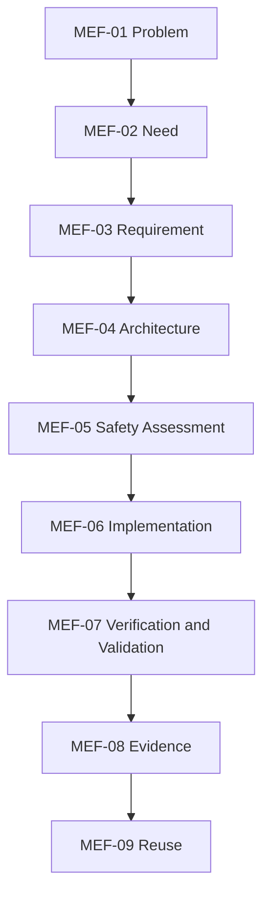
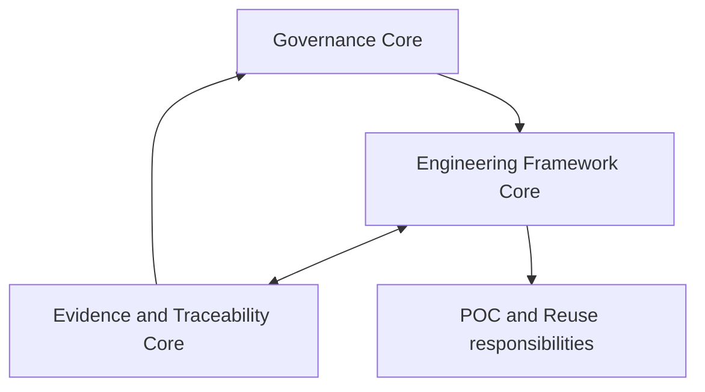

# MBSA Lab OS — Minimal Engineering Framework

## 1. Purpose

This document defines the Minimal Engineering Framework (MEF) of MBSA Lab OS.
It establishes a reusable, technology-independent lifecycle for transforming a
governed engineering problem into accepted evidence and, when justified, a
reusable engineering asset.

The framework refines `CAP-03 — Engineering Lifecycle Enablement` and
`LC-US012-03 — Engineering Framework Core` from the MBSA Lab OS capability and
logical architecture. It preserves the system boundary established by US011 and
the component responsibilities established by US012.

The MEF is intentionally minimal. It defines the smallest controlled lifecycle
that future proofs of concept can tailor without losing engineering coherence,
decision authority, traceability or evidence discipline.

This document does not claim that the framework has already been demonstrated
operationally. Its initial maturity remains `PARTIAL` until later User Stories
apply it and produce real evidence.

---

## 2. Scope

### 2.1 In scope

This document defines:

- the lifecycle from `Problem` to `Reuse`;
- the purpose, entry criteria, inputs, minimum activities, outputs,
  responsibilities, trace relationships and acceptance conditions of each
  lifecycle stage;
- the transition conditions between lifecycle stages;
- iteration, feedback, reopening and controlled backward movement;
- proportional change and impact management;
- tailoring according to risk, complexity and value;
- the distinction between verification and validation;
- the bounded role of safety assessment;
- the relationship between governance, engineering and evidence;
- the interfaces to future POC, traceability, evidence and Gate work;
- conceptual application to three candidate POCs;
- assumptions, constraints, risks, limitations and mitigations;
- acceptance and verification criteria for this framework definition.

### 2.2 Out of scope

This document does not:

- implement or select a first POC;
- define complete POC requirements, architecture, code or tests;
- define the detailed POC Factory lifecycle reserved for US014;
- define the complete traceability model reserved for US015;
- define the detailed evidence-package structure reserved for US016;
- define the integrated Gate model reserved for US017;
- define physical or deployment architecture;
- select a tool, vendor, product, API, protocol or database;
- assert compliance with a safety, quality or systems-engineering standard;
- modify the MBSA Lab OS system boundary;
- publish private control information;
- start US014 or any later User Story.

### 2.3 Intended users

The MEF is intended for maintainers, systems engineers, software engineers,
safety practitioners, verification and validation contributors, reviewers and
future POC teams working within the public MBSA Lab OS boundary.

---

## 3. Source Baseline and Authority

### 3.1 Controlled entry baseline

The controlled public entry baseline for US013 is:

```text
76651788a5e3c5805c90240e500e1c4f2b90838b
```

This baseline contains the approved US011 system context and US012 capability
and logical architecture.

### 3.2 Public authoritative sources

The public sources applicable to this framework are, in descending order of
specificity:

1. `docs/08_MBSA_Lab_OS_Capability_and_Logical_Architecture.md`;
2. `docs/07_MBSA_Lab_OS_System_Context_and_Boundaries.md`;
3. `docs/03_Engineering_Governance.md` through
   `docs/06_Sprint_1_Closure_and_Governance_Baseline.md`;
4. `docs/00_Project_Overview.md`, `docs/01_Vision.md`, `docs/02_Mission.md` and
   `README.md`.

### 3.3 Authority rule

When sources differ:

1. real Git evidence and the latest approved applicable decision govern;
2. US012 governs capabilities, logical components, interfaces and flows;
3. US011 governs the System of Interest and system boundary;
4. baselined governance governs decisions and change control;
5. historical descriptions remain historical and are not silently rewritten;
6. roadmap intent never proves implementation maturity.

Any conflict affecting scope, boundary, allocation, confidentiality, baseline or
acceptance requires a controlled decision before further implementation.

### 3.4 Confidentiality rule

Only public, reviewed and necessary information belongs in this document. No
private planning source, credential, personal datum or unpublished control
content may be copied into the public repository.

---

## 4. Terminology

| Term | Definition in this framework |
|---|---|
| Problem | A governed statement of an observed or anticipated condition that warrants engineering attention. |
| Need | A stakeholder-oriented expression of desired value or outcome derived from the problem. |
| Requirement | A necessary, feasible and verifiable statement that constrains the solution or its lifecycle. |
| Architecture | A coherent set of decisions, structures, responsibilities and interfaces that satisfies allocated requirements. |
| Safety Assessment | A proportional examination of hazards, harmful outcomes, safety concerns and associated risk controls. |
| Implementation | The realization or configured representation of the approved architecture for a bounded POC scope. |
| Verification | Confirmation, using objective evidence, that a work product satisfies its specified requirements or acceptance criteria. |
| Validation | Confirmation, using objective evidence, that the resulting solution or outcome addresses the intended need in its context of use. |
| Evidence | A controlled reference to an observation, analysis, review, test result or decision that supports or challenges a claim. |
| Reuse | Controlled use of verified engineering knowledge or an asset in a different applicable context. |
| Work product | A governed engineering output with an identifier, owner, state and trace relationships. |
| Checkpoint | A bounded decision point used by this framework; it is not the complete integrated Gate model reserved for US017. |
| Tailoring | A justified adjustment of lifecycle depth or rigor without removing mandatory control objectives. |
| Reopening | A controlled return of an accepted work product or stage to an active state after a relevant change, defect or new evidence. |

### 4.1 Normative language

`Must` denotes a mandatory framework rule. `Should` denotes the default rule
unless a documented justification supports an alternative. `May` denotes an
allowed option.

---

## 5. Framework Principles

### MEF-P01 — Govern before producing

The problem, scope, acceptance conditions and decision authority must be clear
before solution work begins.

### MEF-P02 — Preserve the boundary

Engineering refinement must remain inside the US011 system boundary and respect
the public/private trust boundary.

### MEF-P03 — Separate governance, production and evidence

Governance decides and baselines. Engineering produces work products. Evidence
and Traceability maintains evidence references, trace links and assurance state.
These responsibilities collaborate but are not interchangeable.

### MEF-P04 — Trace progressively

Traceability must exist from the first controlled problem statement and become
more precise as work products mature. Missing links must be visible rather than
inferred.

### MEF-P05 — Make acceptance explicit

Every stage must have stated entry criteria, acceptance criteria and transition
conditions. Completion is not inferred from document existence.

### MEF-P06 — Remain technology-independent

Lifecycle rules must not depend on a commercial tool, vendor-specific format or
single implementation technology.

### MEF-P07 — Apply proportional rigor

The depth of analysis and evidence should reflect risk, complexity and expected
value. Tailoring must not remove essential governance, traceability or evidence.

### MEF-P08 — Iterate under control

Feedback and backward movement are normal engineering behavior. Their cause,
impact and resulting decisions must be recorded.

### MEF-P09 — Evidence precedes claims

No maturity, verification, validation, safety or reuse claim may exceed the
available objective evidence.

### MEF-P10 — Reuse follows demonstrated applicability

A reusable asset must have verified source evidence, explicit assumptions and a
new-context applicability assessment.

### MEF-P11 — Stay POC-independent

The framework must work for the Emergency Stop Button, Door Interlock Safety
System and Overtemperature Protection System without unjustified specialization.

### MEF-P12 — Preserve historical integrity

New decisions supersede applicable earlier decisions through traceable change;
they do not silently alter historical records.

---

## 6. Relationship to US011 and US012

### 6.1 US011 boundary contract

MBSA Lab OS remains the System of Interest. Governance Core, Engineering
Framework, POC Factory, Pattern Library, publication-governance and evidence
responsibilities are inside its logical boundary at their approved maturity.
Private Strategic Control content remains outside the public repository unless
explicitly approved for publication.

### 6.2 US012 architecture contract

The MEF refines the following controlled elements:

| US012 element | MEF use |
|---|---|
| `CAP-03` | Provides reusable engineering-lifecycle enablement. |
| `LC-US012-03` | Owns lifecycle structure and engineering work-product relationships. |
| `LC-US012-02` | Governs scope, decisions, acceptance and baselines. |
| `LC-US012-04` | Maintains evidence references, trace links, limitations and assurance state. |
| `IF-US012-02` | Carries governance requests, decisions and baseline authority. |
| `IF-US012-03` | Exchanges engineering work products with evidence, POC and reuse responsibilities. |
| `IF-US012-04` | Exchanges evidence references, trace links, findings and limitations. |
| `FL-US012-02` | Provides the end-to-end flow from governed problem to verified evidence. |

US013 does not change these allocations. Any later proposed change requires an
explicit architecture decision and impact review.

### 6.3 Maturity

Governance Core is `BASELINED`. Engineering Framework Core and Evidence &
Traceability Core remain `PARTIAL`. This document improves definition maturity;
it does not prove operational maturity.

---

## 7. Minimal Engineering Framework Overview

### 7.1 Lifecycle chain



The arrows show the nominal progression, not an irreversible waterfall. Each
stage may reveal information requiring controlled movement to an earlier stage.

### 7.2 Cross-cutting control



Governance constrains all lifecycle stages. Evidence and traceability operate
throughout the lifecycle rather than only after implementation.

### 7.3 Stage states

Each stage may use the following minimal states:

| State | Meaning |
|---|---|
| `PROPOSED` | Content exists but has not completed its required review. |
| `IN REVIEW` | Assigned participants are evaluating the work product. |
| `ACCEPTED` | Acceptance criteria are demonstrated for the current scope. |
| `BASELINED` | Governance has established the accepted version as the controlled reference. |
| `REOPENED` | A change, defect or new evidence requires further work. |
| `REJECTED` | The work product or transition is not acceptable; rationale is recorded. |

These lifecycle states do not replace repository or issue workflow states.

---

## 8. Lifecycle States and Transition Rules

### 8.1 Common entry rule

A stage may start when:

- its purpose and scope are understood;
- required upstream work products exist or a justified exception is recorded;
- applicable assumptions and constraints are visible;
- responsibility and reviewers are assigned;
- applicable acceptance criteria are defined;
- known blocking contradictions are resolved or formally deferred.

### 8.2 Common acceptance rule

A stage may be accepted when:

- mandatory outputs exist and are internally consistent;
- acceptance criteria are demonstrated by identifiable evidence;
- upstream and downstream trace relationships are recorded at the required
  tailoring level;
- unresolved findings, assumptions and limitations are visible;
- affected stakeholders or logical participants completed the required review;
- governance records the resulting decision.

### 8.3 Common transition rule

Acceptance authorizes the next stage only for the accepted scope and baseline.
Parallel or overlapping work may be authorized when dependencies, assumptions
and rework risk are explicit. Starting downstream work does not implicitly
accept incomplete upstream work.

### 8.4 Common reopening triggers

A stage must be considered for reopening when:

- an upstream work product changes;
- a requirement, interface or assumption is invalidated;
- verification or validation fails;
- a safety concern is discovered or its risk changes;
- new evidence contradicts an accepted claim;
- the intended context of use changes;
- a reuse assessment identifies an applicability gap.

---

## 9. MEF-01 — Problem

| Attribute | Minimum definition |
|---|---|
| Objective | Establish a governed, evidence-based problem statement without prematurely selecting a solution. |
| Entry criteria | A credible observation, opportunity, concern or requested outcome exists. |
| Inputs | Observations, stakeholder feedback, incidents, prior evidence, strategic direction and known constraints. |
| Minimum activities | Identify source and context; distinguish fact, interpretation and assumption; define affected stakeholders and boundary; state urgency and consequences; identify initial unknowns. |
| Outputs | `WP-MEF-01 Problem Statement`, source references, initial scope, assumptions, constraints and problem acceptance criteria. |
| Accountable responsibility | Governance Core accepts the problem scope; Engineering Framework Core structures the work product. |
| Participants | Problem originator, relevant stakeholders, engineering and Evidence & Traceability Core. |
| Upstream trace | Source observation, decision, incident, feedback or strategic input. |
| Downstream trace | Needs, initial risks, constraints and investigation questions. |
| Acceptance criteria | Problem is relevant, bounded, solution-neutral, sourced and understandable; facts and assumptions are separated. |
| Checkpoint | `CP-MEF-01 — Problem Accepted`. |
| Risks and limitations | Solution bias, ambiguous boundary, unsupported urgency, hidden private input and duplicated problem statements. |
| Reopening rules | Reopen when context, source credibility, boundary, consequence or stakeholder impact changes materially. |
| Transition condition | At least one stakeholder need can be derived without assuming a specific implementation. |

---

## 10. MEF-02 — Need

| Attribute | Minimum definition |
|---|---|
| Objective | Translate the accepted problem into stakeholder-oriented outcomes and value expectations. |
| Entry criteria | `WP-MEF-01` is accepted for the working scope. |
| Inputs | Problem statement, stakeholder context, constraints, operating scenarios and prior knowledge. |
| Minimum activities | Identify stakeholders; define desired outcomes; capture context of use; prioritize or classify needs; identify conflicts; define validation intent. |
| Outputs | `WP-MEF-02 Need Set`, stakeholder/context mapping, need rationale and validation intent. |
| Accountable responsibility | Engineering Framework Core owns the need work product; Governance Core resolves scope or priority conflicts. |
| Participants | Stakeholders, systems engineering, safety contributor and validation representative. |
| Upstream trace | Each need traces to one or more accepted problems or governed objectives. |
| Downstream trace | Requirements, validation criteria and architecture drivers. |
| Acceptance criteria | Needs are outcome-oriented, stakeholder-linked, necessary, non-duplicative and consistent with the boundary. |
| Checkpoint | `CP-MEF-02 — Needs Accepted`. |
| Risks and limitations | Stakeholder omission, disguised design decisions, contradictory needs and unmeasurable value. |
| Reopening rules | Reopen when stakeholder, context, priority, problem scope or validation intent changes. |
| Transition condition | Needs are sufficiently clear to derive verifiable requirements and constraints. |

---

## 11. MEF-03 — Requirement

| Attribute | Minimum definition |
|---|---|
| Objective | Define necessary, feasible and verifiable statements that constrain the solution and its lifecycle. |
| Entry criteria | Applicable needs and constraints are accepted or explicitly provisional. |
| Inputs | Need set, context, assumptions, constraints, risk information and validation intent. |
| Minimum activities | Derive requirements; define rationale and acceptance method; remove ambiguity; analyze conflicts and feasibility; classify requirement type; establish bidirectional traces. |
| Outputs | `WP-MEF-03 Requirement Set`, rationale, verification method intent, conflict log and trace links. |
| Accountable responsibility | Engineering Framework Core owns requirement definition; Governance Core accepts changes to controlled scope. |
| Participants | Systems engineering, domain contributors, architecture, safety, implementation and V&V representatives. |
| Upstream trace | Every requirement traces to a need, constraint, risk control or governed decision. |
| Downstream trace | Architecture decisions, safety measures, implementation expectations and verification cases. |
| Acceptance criteria | Requirements are necessary, singular enough for review, feasible, unambiguous at the chosen rigor, verifiable and traceable. |
| Checkpoint | `CP-MEF-03 — Requirements Accepted`. |
| Risks and limitations | Orphan requirements, unverifiable wording, excessive detail, missing non-functional constraints and premature design. |
| Reopening rules | Reopen after need change, feasibility issue, architecture conflict, failed verification or safety finding. |
| Transition condition | Architecture can allocate accepted requirements without unresolved blocking contradiction. |

---

## 12. MEF-04 — Architecture

| Attribute | Minimum definition |
|---|---|
| Objective | Establish coherent structures, responsibilities, interfaces and decisions that satisfy the allocated requirements. |
| Entry criteria | Architecture-driving requirements, constraints and major risks are identified. |
| Inputs | Requirement set, context and boundary, existing architecture, assumptions, constraints and risk information. |
| Minimum activities | Identify alternatives; define logical responsibilities and interfaces; allocate requirements; analyze dependencies and trade-offs; record decisions and rejected alternatives; assess consistency. |
| Outputs | `WP-MEF-04 Architecture Definition`, allocation matrix, interface definitions, decision records and identified verification needs. |
| Accountable responsibility | Engineering Framework Core owns the engineering structure; Governance Core accepts architecture decisions and baselines. |
| Participants | Architecture, systems and software engineering, safety, implementation, V&V and evidence contributors. |
| Upstream trace | Architecture elements and decisions trace to requirements, constraints and risks. |
| Downstream trace | Safety analysis items, implementation expectations, integration points and verification cases. |
| Acceptance criteria | Architecture is boundary-consistent, allocated, internally coherent, technology-independent at the intended level and sufficiently defined for safety and implementation work. |
| Checkpoint | `CP-MEF-04 — Architecture Accepted`. |
| Risks and limitations | Tool-driven design, hidden coupling, unjustified allocation, interface gaps, maturity inflation and single-POC specialization. |
| Reopening rules | Reopen after requirement change, safety finding, implementation infeasibility, interface conflict or failed V&V. |
| Transition condition | Safety concerns can be assessed and implementation expectations can be defined from controlled architecture decisions. |

---

## 13. MEF-05 — Safety Assessment

| Attribute | Minimum definition |
|---|---|
| Objective | Identify and evaluate safety concerns proportionally, derive necessary controls and expose residual uncertainty without claiming full normative compliance. |
| Entry criteria | Problem context, relevant requirements and architecture are sufficiently defined for hazard-oriented reasoning. |
| Inputs | Context, operating scenarios, requirements, architecture, assumptions, interfaces and known hazards or failure information. |
| Minimum activities | Identify hazardous conditions; reason about causes and consequences; classify risk using the approved project method when available; identify controls; allocate derived safety requirements; define safety-related verification needs; record limitations. |
| Outputs | `WP-MEF-05 Safety Assessment`, hazard or concern log, derived controls, safety-related requirements, assumptions and verification intent. |
| Accountable responsibility | Engineering Framework Core integrates safety work; Governance Core accepts risk decisions; Evidence & Traceability Core maintains supporting references. |
| Participants | Safety practitioner or designated contributor, systems engineering, architecture, implementation and V&V. |
| Upstream trace | Safety concerns trace to context, functions, interfaces, architecture decisions, assumptions or evidence. |
| Downstream trace | Controls trace to requirements, architecture elements, implementation expectations and V&V cases. |
| Acceptance criteria | Relevant concerns are visible, controls are traceable, residual risks and limitations are explicit, and claims do not exceed the method or evidence used. |
| Checkpoint | `CP-MEF-05 — Safety Position Accepted for Scope`. |
| Risks and limitations | False compliance claims, incomplete hazard coverage, unsupported risk classification and disconnected safety requirements. |
| Reopening rules | Reopen after context, requirement, architecture, failure behavior, control effectiveness or evidence changes. |
| Transition condition | Required controls are allocated and implementation/V&V work can address them. |

The MEF does not mandate a specific safety-analysis technique. The selected
technique and rigor must be justified by the POC risk and context. Normative
compliance requires a separate, explicitly authorized compliance strategy.

---

## 14. MEF-06 — Implementation

| Attribute | Minimum definition |
|---|---|
| Objective | Realize the accepted architecture and requirements within a bounded, reproducible and reviewable POC scope. |
| Entry criteria | Applicable requirements, architecture decisions, interfaces and required safety controls are accepted or explicitly baselined for implementation. |
| Inputs | Architecture, requirements, safety controls, interface definitions, implementation constraints and V&V intent. |
| Minimum activities | Plan the realization; implement or configure; maintain requirement and architecture alignment; apply quality controls; record deviations; prepare reproducible build or setup information; conduct implementation-level reviews. |
| Outputs | `WP-MEF-06 Implementation Realization`, configuration or code references, build/setup information, deviation records and implementation review evidence. |
| Accountable responsibility | The future POC Factory performs realization under Engineering Framework structure and Governance Core control. |
| Participants | Software, hardware or model contributors as applicable, architecture, safety, configuration management and V&V. |
| Upstream trace | Implementation items trace to allocated requirements, architecture elements, interfaces and safety controls. |
| Downstream trace | Verification items, integration observations, defects, limitations and evidence references. |
| Acceptance criteria | Realization scope is controlled, reproducible at the tailored level, traceable, reviewable and free of unexplained deviation from accepted inputs. |
| Checkpoint | `CP-MEF-06 — Implementation Ready for V&V`. |
| Risks and limitations | Scope leakage, undocumented deviation, environment dependency, weak reproducibility and implementation-before-architecture. |
| Reopening rules | Reopen after upstream change, defect, failed build, interface issue, safety concern or failed verification. |
| Transition condition | The realization and its configuration are sufficiently stable to execute the planned V&V activities. |

This section defines implementation expectations only. US013 does not implement
any POC.

---

## 15. MEF-07 — Verification and Validation

| Attribute | Minimum definition |
|---|---|
| Objective | Produce objective results showing whether work products satisfy their specified criteria and whether the solution addresses intended stakeholder needs. |
| Entry criteria | Controlled items under evaluation, expected results, methods, environment and acceptance criteria are identified. |
| Inputs | Needs, requirements, architecture, safety controls, implementation, configuration baseline and V&V plan. |
| Minimum activities | Review independence needs; prepare cases and procedures; confirm environment; execute reviews, analyses or tests; record actual results; manage anomalies; evaluate coverage; separate verification and validation conclusions. |
| Outputs | `WP-MEF-07 V&V Results`, executed-case records, actual observations, anomaly records, coverage status and separate verification/validation conclusions. |
| Accountable responsibility | Engineering Framework Core structures V&V; Governance Core accepts conclusions; Evidence & Traceability Core maintains result references and trace links. |
| Participants | V&V contributors, stakeholders for validation, engineering, architecture, safety and implementation representatives. |
| Upstream trace | Verification cases trace to requirements, architecture and controls; validation scenarios trace to stakeholder needs and context. |
| Downstream trace | Evidence claims, acceptance decisions, defects, reopening decisions and reuse limitations. |
| Acceptance criteria | Methods and configurations are identified, actual results are preserved, deviations are visible, coverage is evaluated and conclusions match the evidence. |
| Checkpoint | `CP-MEF-07 — V&V Conclusion Reviewed`. |
| Risks and limitations | Planned results presented as actual, verification/validation confusion, untraceable tests, environment ambiguity and ignored failures. |
| Reopening rules | Reopen after item change, environment invalidation, test defect, new failure, coverage gap or stakeholder rejection. |
| Transition condition | Results and limitations are sufficient for an evidence-based acceptance decision. |

---

## 16. MEF-08 — Evidence

| Attribute | Minimum definition |
|---|---|
| Objective | Assemble controlled references and trace relationships that support or challenge engineering and acceptance claims. |
| Entry criteria | Claims, acceptance criteria and relevant source results are identifiable. |
| Inputs | Reviews, analyses, V&V results, decisions, work-product baselines, anomalies, risks and limitations. |
| Minimum activities | Identify claims; link supporting and contradicting evidence; check provenance and configuration; assess sufficiency; record gaps and limitations; present acceptance demonstration; preserve evidence references. |
| Outputs | `WP-MEF-08 Evidence Set`, claim-evidence mapping, trace status, assurance position, gaps, limitations and acceptance recommendation. |
| Accountable responsibility | Evidence & Traceability Core owns evidence references and assurance state; Governance Core owns acceptance decisions. |
| Participants | Evidence owner, engineering, V&V, safety, configuration management and reviewers. |
| Upstream trace | Every evidence item traces to its source work product, activity, configuration and result. |
| Downstream trace | Acceptance decisions, maturity statements, reuse candidates and publication authorization. |
| Acceptance criteria | Evidence is attributable, relevant, configuration-aware, reviewable and sufficient for the stated claim, with contradictions and gaps visible. |
| Checkpoint | `CP-MEF-08 — Evidence Position Accepted`. |
| Risks and limitations | Cherry-picking, broken provenance, evidence duplication, stale configuration, claim inflation and hidden contradictory results. |
| Reopening rules | Reopen after claim, source, configuration, result, limitation or acceptance criterion changes. |
| Transition condition | Governance can accept, reject or conditionally accept the engineering conclusion and identify whether reuse assessment is justified. |

US016 will define the detailed evidence-package structure. This stage defines
only the minimum lifecycle responsibility and acceptance objective.

---

## 17. MEF-09 — Reuse

| Attribute | Minimum definition |
|---|---|
| Objective | Determine whether a verified work product or recurring solution structure can be reused safely and coherently in another context. |
| Entry criteria | Source work products and their evidence, assumptions, constraints and limitations are available. |
| Inputs | Accepted engineering conclusion, evidence set, source context, candidate asset and proposed reuse context. |
| Minimum activities | Define the reusable unit; compare source and target contexts; assess assumptions and constraints; identify required adaptation; evaluate evidence applicability; record residual gaps; classify as not reusable, pattern candidate or approved reusable asset according to future governance. |
| Outputs | `WP-MEF-09 Reuse Assessment`, applicability matrix, adaptation needs, inherited evidence limits and pattern-candidate recommendation. |
| Accountable responsibility | Pattern & Reuse Core owns future reusable assets; Governance Core authorizes admission; Engineering Framework Core supplies lifecycle context. |
| Participants | Source engineers, target-context engineers, evidence, safety, architecture and governance reviewers. |
| Upstream trace | Reuse candidate traces to source work products, evidence, decisions, assumptions and limitations. |
| Downstream trace | Pattern candidate, future target problem/need, adaptation requirements and new evidence obligations. |
| Acceptance criteria | Source evidence exists, contexts are compared, assumptions and limitations are explicit, adaptation is identified and no source claim is transferred without applicability justification. |
| Checkpoint | `CP-MEF-09 — Reuse Disposition`. |
| Risks and limitations | Context-free copying, inherited defect, invalid evidence transfer, hidden adaptation cost and premature pattern admission. |
| Reopening rules | Reopen when source evidence, target context, assumption, limitation or candidate asset changes. |
| Transition condition | A governed disposition is recorded: reject reuse, request further evidence, retain as pattern candidate or admit through future pattern governance. |

US013 does not admit a pattern. It defines only the minimum route to a justified
reuse disposition.

---

## 18. Iteration, Feedback and Reopening

### 18.1 Iteration rule

Iteration is permitted within or between stages when it improves understanding
or resolves uncertainty. Each material iteration must identify:

- its trigger;
- affected work products and baselines;
- expected outcome;
- responsible participants;
- evidence required to close the iteration;
- whether downstream work may continue provisionally.

### 18.2 Backward movement

Backward movement is mandatory when a downstream finding invalidates an
upstream assumption, criterion, allocation or decision. It is not treated as a
process failure. Uncontrolled continuation after invalidation is a failure.

### 18.3 Reopening decision

Governance determines whether a baselined work product is reopened, superseded
or left unchanged with a documented limitation. The decision must link the
trigger, affected baseline, impact assessment and disposition.

### 18.4 Feedback destinations

| Finding originates in | Typical feedback destination |
|---|---|
| Requirement review | Need or Problem |
| Architecture analysis | Requirement, Need or Problem |
| Safety assessment | Architecture, Requirement or Need |
| Implementation | Architecture or Requirement |
| Verification | Implementation, Architecture or Requirement |
| Validation | Need, Problem, Architecture or Requirement |
| Evidence review | Any unsupported stage or acceptance decision |
| Reuse assessment | Source assumptions, Evidence or new target Problem |

---

## 19. Change and Impact Management

### 19.1 Minimum change record

A material change must identify:

1. change request and rationale;
2. originator and decision authority;
3. affected work products, traces and baselines;
4. safety, technical, schedule, evidence and reuse impacts as applicable;
5. options and recommended disposition;
6. required rework and reverification or revalidation;
7. approval, rejection or deferral decision;
8. resulting baseline and residual limitations.

### 19.2 Proportional impact analysis

Impact depth depends on the tailoring level, but every material change must at
least examine upstream causes, downstream consumers, affected acceptance
criteria, existing evidence and public/private classification.

### 19.3 Change propagation

A changed work product does not silently invalidate or update its consumers.
Affected downstream owners must confirm whether their work product remains
valid, requires review or must be reopened.

---

## 20. Tailoring Model

### 20.1 Tailoring dimensions

Tailoring decisions consider:

- severity and reversibility of harmful outcomes;
- novelty and technical uncertainty;
- number and complexity of interfaces;
- stakeholder diversity and validation difficulty;
- implementation and environment complexity;
- evidence and reuse ambitions;
- public visibility and reputational impact.

### 20.2 Tailoring levels

| Level | Typical condition | Expected depth |
|---|---|---|
| `T1 — Lightweight` | Low complexity, low consequence, familiar solution and limited reuse claim | Concise work products, peer review and direct trace coverage. |
| `T2 — Standard` | Moderate complexity, several interfaces, meaningful uncertainty or intended public demonstration | Structured analyses, explicit alternatives, planned V&V, coverage review and formal acceptance evidence. |
| `T3 — Enhanced` | Safety significance, high uncertainty, complex interfaces or strong reuse/public claims | Deeper independent review, broader scenario and risk analysis, stronger configuration control and expanded evidence. |

The level names express MBSA Lab OS engineering rigor only. They do not denote
compliance with an external standard.

### 20.3 Non-tailorable objectives

Tailoring must not remove:

- a governed problem and scope;
- identifiable needs and acceptance intent;
- controlled requirements appropriate to the scope;
- architecture rationale and allocation;
- proportional safety consideration;
- controlled implementation configuration when implementation occurs;
- objective V&V results;
- claim-to-evidence discipline;
- change impact visibility;
- public/private protection.

### 20.4 Tailoring decision record

The selected level, rationale, deviations, compensating controls and approver
must be recorded before the affected activity is considered complete.

---

## 21. Governance, Engineering and Evidence Responsibilities

| Responsibility | Accountable for | Must not claim ownership of |
|---|---|---|
| Governance Core | Scope, AC, DoD, decisions, reviews, acceptance, baselines and change authority | Detailed engineering content or raw evidence production |
| Engineering Framework Core | Lifecycle state, engineering work products and their relationships | Final evidence acceptance or external tools |
| Evidence & Traceability Core | Evidence references, trace links, assurance status, findings and limitations | Underlying engineering source artefacts |
| POC Factory Logic | Future repeatable realization of controlled POCs | Governance decisions or pattern admission |
| Pattern & Reuse Core | Future reusable assets, applicability knowledge and pattern candidates | Unsupported transfer of source claims |
| Publication Governance Gateway | Authorization of stable, classified public content | Engineering truth creation |

### 21.1 Participation rule

One participant may perform several roles in a small POC, but the logical
responsibilities and decision records remain distinguishable. Combining people
does not collapse governance, engineering and evidence accountabilities.

---

## 22. Logical Interfaces and Work-Product Exchanges

### 22.1 `IF-US012-02 — Governance Decision and Baseline`

The MEF uses this interface for scope, tailoring, acceptance criteria, change
decisions, checkpoint dispositions and baseline authority.

### 22.2 `IF-US012-03 — Engineering Work Product Exchange`

The MEF uses this interface to exchange needs, requirements, architecture,
implementation expectations, V&V inputs and reuse candidates between
Engineering Framework, Evidence, POC and Reuse responsibilities.

### 22.3 `IF-US012-04 — Evidence and Trace Link Exchange`

The MEF uses this interface to exchange evidence references, trace links,
findings, assurance state and limitations with every producing responsibility.

### 22.4 Minimum work-product envelope

Each controlled work product should expose:

| Field | Purpose |
|---|---|
| Identifier and title | Stable human and machine reference |
| Version or baseline | Configuration awareness |
| State | Lifecycle status |
| Owner and participants | Accountability and contribution |
| Source and rationale | Provenance |
| Assumptions and constraints | Applicability boundary |
| Upstream/downstream traces | Lifecycle coherence |
| Acceptance criteria | Expected proof |
| Evidence references | Actual proof or identified gap |
| Findings and limitations | Claim discipline |
| Decision reference | Governance disposition |

---

## 23. Multi-POC Conceptual Application

The following application is conceptual. It tests framework genericity and does
not create detailed requirements, architectures, implementations or V&V results.

### 23.1 Emergency Stop Button

| Stage | Conceptual application |
|---|---|
| Problem | A hazardous or undesired process may require rapid human-initiated stopping. |
| Need | An operator needs an understandable and dependable way to request a safe stop. |
| Requirement | Future work would define response, state, interface and diagnostic expectations. |
| Architecture | Future work would allocate sensing, decision, actuation, indication and diagnostic responsibilities. |
| Safety Assessment | Consider unintended activation, failure to activate, delayed stop, common cause and misleading indication. |
| Implementation | Reserved for a later authorized POC. |
| V&V | Would verify specified behavior and validate usability and intended risk reduction in the defined context. |
| Evidence | Would link configuration, executed results, anomalies and acceptance decisions. |
| Reuse | Could identify reusable stop-request, state-management or evidence patterns after demonstrated applicability. |

### 23.2 Door Interlock Safety System

| Stage | Conceptual application |
|---|---|
| Problem | Operation in an unsafe door state may expose people or equipment to harm. |
| Need | Stakeholders need operation to be inhibited or controlled when the door state is unsafe. |
| Requirement | Future work would define state detection, permitted transitions, fault response and timing expectations. |
| Architecture | Future work would allocate sensing, interlock logic, actuation, indication and diagnostics. |
| Safety Assessment | Consider sensor faults, bypass, sequencing errors, latent failure and incorrect state interpretation. |
| Implementation | Reserved for a later authorized POC. |
| V&V | Would verify transition logic and fault reactions and validate safe use scenarios. |
| Evidence | Would preserve scenario, configuration, result and limitation links. |
| Reuse | Could assess reusable interlock-state or diagnostic structures in another context. |

### 23.3 Overtemperature Protection System

| Stage | Conceptual application |
|---|---|
| Problem | Excess temperature may damage equipment or create an unsafe condition. |
| Need | Stakeholders need temperature excursions detected and controlled before unacceptable consequences occur. |
| Requirement | Future work would define thresholds, timing, hysteresis, degraded behavior and diagnostic expectations. |
| Architecture | Future work would allocate sensing, filtering, decision, protection actuation, indication and logging. |
| Safety Assessment | Consider sensor bias, delayed detection, nuisance activation, thermal inertia and actuator failure. |
| Implementation | Reserved for a later authorized POC. |
| V&V | Would verify threshold and fault behavior and validate protection in representative thermal scenarios. |
| Evidence | Would link calibrated inputs, configuration, executed results and risk-control conclusions. |
| Reuse | Could assess reusable monitoring, threshold or protective-action patterns. |

### 23.4 Genericity conclusion

All three candidates use the same nine stages, responsibility separation,
traceability direction and acceptance logic. Their engineering content and
tailoring depth differ. This demonstrates conceptual genericity only; it is not
operational validation of the framework.

---

## 24. Lifecycle Work-Product Matrix

| Stage | Primary work product | Minimum downstream consumer |
|---|---|---|
| MEF-01 Problem | `WP-MEF-01 Problem Statement` | Needs and governance |
| MEF-02 Need | `WP-MEF-02 Need Set` | Requirements and validation |
| MEF-03 Requirement | `WP-MEF-03 Requirement Set` | Architecture, safety and verification |
| MEF-04 Architecture | `WP-MEF-04 Architecture Definition` | Safety, implementation and V&V |
| MEF-05 Safety Assessment | `WP-MEF-05 Safety Assessment` | Requirements, architecture, implementation and V&V |
| MEF-06 Implementation | `WP-MEF-06 Implementation Realization` | V&V and evidence |
| MEF-07 V&V | `WP-MEF-07 V&V Results` | Evidence and acceptance |
| MEF-08 Evidence | `WP-MEF-08 Evidence Set` | Governance, reuse and publication |
| MEF-09 Reuse | `WP-MEF-09 Reuse Assessment` | Pattern governance and future engineering |

---

## 25. Responsibility and Participation Matrix

Legend: `A` accountable logical responsibility, `P` expected participant,
`C` consulted as applicable.

| Stage | Governance | Engineering Framework | Evidence & Traceability | POC Factory | Pattern & Reuse |
|---|---:|---:|---:|---:|---:|
| Problem | A | P | P | C | C |
| Need | P | A | P | C | C |
| Requirement | P | A | P | C | C |
| Architecture | P | A | P | C | C |
| Safety Assessment | A | P | P | C | C |
| Implementation | P | P | P | A | C |
| V&V | A | P | P | P | C |
| Evidence | A | P | A | P | C |
| Reuse | A | P | P | C | A |

Two `A` entries in a row represent different accountabilities, such as evidence
content stewardship versus acceptance authority. The associated decision record
must state which accountability is exercised.

---

## 26. Traceability and Acceptance Matrix

| From | To | Minimum relationship | Acceptance question |
|---|---|---|---|
| Source | Problem | motivates / reports | Is the problem credible and bounded? |
| Problem | Need | derives | Does the need address the accepted problem? |
| Need | Requirement | satisfied by | Do requirements preserve intended value? |
| Requirement | Architecture | allocated to | Is every applicable requirement allocated coherently? |
| Architecture | Safety Assessment | analyzed by | Are relevant harmful outcomes and controls considered? |
| Architecture / Safety | Implementation | realized by | Does realization follow accepted decisions and controls? |
| Requirement / Need | V&V | verified / validated by | Do actual results address criteria and intended outcome? |
| Claim | Evidence | supported or challenged by | Is the claim no stronger than its evidence? |
| Evidence | Reuse | constrains applicability of | Can the source evidence apply in the target context? |

Trace direction must be navigable both upstream and downstream at the selected
tailoring level. US015 will refine the complete traceability model.

---

## 27. Assumptions and Constraints

### 27.1 Assumptions

- `A-US013-01`: future POCs will apply a documented tailoring decision.
- `A-US013-02`: the detailed POC Factory, traceability, evidence and Gate models
  will refine this framework without silently changing its responsibilities.
- `A-US013-03`: small POCs may combine human roles while preserving logical
  accountability separation.
- `A-US013-04`: repository-native text artefacts are sufficient for the first
  framework baseline.
- `A-US013-05`: conceptual multi-POC application is adequate to test definition
  genericity but not operational effectiveness.

### 27.2 Constraints

- `C-US013-01`: preserve the US011 system boundary.
- `C-US013-02`: preserve US012 capability and component allocations.
- `C-US013-03`: keep public and private information separated.
- `C-US013-04`: remain technology- and vendor-independent.
- `C-US013-05`: do not claim implementation, V&V or reuse evidence that does not
  exist.
- `C-US013-06`: do not specialize the framework to one POC.
- `C-US013-07`: do not implement US014 through US017.
- `C-US013-08`: use repository-native Markdown, UTF-8 and controlled Git
  workflow.
- `C-US013-09`: retain visible assumptions, limitations and maturity.
- `C-US013-10`: preserve historical decisions and use controlled supersession.

---

## 28. Risks, Limitations and Mitigations

| ID | Risk or limitation | Mitigation |
|---|---|---|
| R-US013-01 | The framework becomes a rigid waterfall. | Explicit iteration, reopening and provisional parallel-work rules. |
| R-US013-02 | Minimal is interpreted as optional governance or evidence. | Non-tailorable objectives and common acceptance rules. |
| R-US013-03 | The framework is specialized to Emergency Stop Button. | Mandatory comparison with two alternative POCs. |
| R-US013-04 | Verification and validation are conflated. | Separate definitions, trace origins and conclusions. |
| R-US013-05 | Safety assessment implies normative compliance. | Explicitly bounded safety role and no-compliance claim. |
| R-US013-06 | US013 absorbs US014–US017. | Explicit downstream interface boundaries. |
| R-US013-07 | Evidence is created after decisions merely to justify them. | Evidence responsibilities operate throughout the lifecycle. |
| R-US013-08 | Reuse transfers invalid assumptions or claims. | Mandatory source/target applicability assessment. |
| R-US013-09 | Tool choice drives the logical lifecycle. | Technology-independent terminology and work-product envelope. |
| R-US013-10 | Private control information leaks into public artefacts. | Conservative classification and publication review. |
| R-US013-11 | Definition maturity is presented as operational maturity. | Maturity statement remains `PARTIAL` until real application evidence. |
| R-US013-12 | Responsibility matrices hide conflicts between accountabilities. | Decision records distinguish content stewardship and acceptance authority. |

### 28.1 Current limitations

- no POC has yet executed the complete framework;
- no empirical cycle-time or rework metric exists;
- tailoring thresholds remain qualitative;
- detailed trace-link semantics await US015;
- detailed evidence packaging awaits US016;
- integrated Gate semantics await US017;
- normative safety compliance is not addressed.

---

## 29. Interfaces to US014–US017

| Downstream US | Input from US013 | Explicit boundary |
|---|---|---|
| US014 — Minimal POC Factory lifecycle | Nine-stage lifecycle, transition expectations, implementation and iteration contract | US013 does not define the detailed POC production workflow. |
| US015 — Traceability Model | Work products, upstream/downstream relationships and minimum trace objectives | US013 does not define complete link semantics, storage or views. |
| US016 — Evidence Package Structure | Evidence-stage purpose, claim/evidence discipline, provenance and limitation needs | US013 does not define the complete package schema. |
| US017 — Architecture and POC Gates | Checkpoint objectives, entry/acceptance/transition conditions and reopening triggers | US013 does not define the integrated Gate model or final Gate numbering. |

US014 through US017 remain `NOT STARTED` until separately authorized.

---

## 30. Acceptance Criteria Traceability

| ID | Acceptance criterion | Primary evidence |
|---|---|---|
| AC-US013-01 | System of Interest and US011 boundaries respected | Sections 2, 3, 6, 27 |
| AC-US013-02 | US012 CAP/LC/IF/FL architecture respected | Sections 3, 6, 21, 22 |
| AC-US013-03 | Framework purpose and principles explicit | Sections 1 and 5 |
| AC-US013-04 | Complete ordered Problem-to-Reuse chain | Sections 7 and 9–17 |
| AC-US013-05 | Each stage has an unambiguous objective | Sections 9–17 |
| AC-US013-06 | Entry criteria and transition conditions defined | Sections 8–17 |
| AC-US013-07 | Minimum inputs and outputs identified | Sections 9–17 and 24 |
| AC-US013-08 | Minimum activities are tool-independent | Sections 5 and 9–17 |
| AC-US013-09 | Logical responsibilities and participants identified | Sections 9–17, 21 and 25 |
| AC-US013-10 | Upstream and downstream trace links explicit | Sections 9–17 and 26 |
| AC-US013-11 | Acceptance criteria defined by stage | Sections 8–17 |
| AC-US013-12 | Checkpoints associated without implementing US017 | Sections 8–17 and 29 |
| AC-US013-13 | Iteration, backward movement and reopening addressed | Section 18 |
| AC-US013-14 | Proportional change and impact addressed | Section 19 |
| AC-US013-15 | Tailoring based on risk, complexity and value | Section 20 |
| AC-US013-16 | Verification and validation distinguished | Sections 4, 15 and 26 |
| AC-US013-17 | Safety Assessment correctly positioned and bounded | Sections 4 and 13 |
| AC-US013-18 | Governance, engineering and evidence distinguished | Sections 5, 7 and 21 |
| AC-US013-19 | IF-US012-02/03/04 used | Sections 6 and 22 |
| AC-US013-20 | FL-US012-02 refined without contradiction | Sections 6–17 |
| AC-US013-21 | Interfaces to US014–US017 identified without implementation | Section 29 |
| AC-US013-22 | Emergency Stop Button conceptual application present | Section 23.1 |
| AC-US013-23 | Door Interlock and Overtemperature test genericity | Sections 23.2–23.4 |
| AC-US013-24 | No unjustified specialization to the first POC | Sections 5, 23 and 28 |
| AC-US013-25 | Actual maturity and limitations visible | Sections 1, 6, 28 and 32 |
| AC-US013-26 | No private information published | Sections 2, 3 and 27 |
| AC-US013-27 | Text, tables, matrices and diagrams coherent | Sections 7 and 21–30 |
| AC-US013-28 | Repository conventions, document quality and Git evidence satisfied | Section 31 and execution evidence |

No criterion is considered passed solely because this table references a
section. The referenced content and actual repository evidence must be reviewed.

---

## 31. Verification Strategy

### 31.1 Content verification

Content review must confirm:

- all 32 approved sections are present;
- all nine lifecycle stages contain the complete minimum contract;
- stage transitions and reopening rules are coherent;
- governance, engineering and evidence accountabilities remain distinct;
- `CAP-03`, `LC-US012-03`, `IF-US012-02/03/04` and `FL-US012-02` are respected;
- tailoring cannot remove mandatory control objectives;
- verification and validation remain distinct;
- safety claims are bounded;
- three conceptual POC applications are present and non-implementing;
- US014–US017 boundaries are preserved;
- assumptions, risks, limitations and maturity are explicit;
- all 28 Acceptance Criteria have credible evidence locations.

### 31.2 Document verification

Repository checks must confirm:

- Markdown is readable and structurally consistent;
- tables and Mermaid diagrams are syntactically coherent;
- identifiers are unique where uniqueness is required;
- links and file references use repository-relative paths;
- no private source, credential or sensitive datum is present;
- encoding is UTF-8 without NUL characters;
- canonical line endings are LF;
- no trailing whitespace or whitespace error is reported.

### 31.3 Git verification

The controlled workflow must:

1. verify branch, baseline, remote and clean working tree;
2. install only `docs/09_Minimal_Engineering_Framework.md`;
3. inspect the unstaged name, stat and full diff;
4. run `git diff --check`;
5. stage only the US013 deliverable after review;
6. inspect cached name, stat, diff and whitespace;
7. commit and capture the real functional SHA;
8. push the feature branch and verify tracking;
9. revalidate `main` and remote state before merge;
10. merge with `--no-ff` and capture the real merge SHA;
11. push `main` and prove local/remote equality;
12. prove functional-commit reachability before branch cleanup;
13. verify final working tree and absence of residue;
14. generate the final US013 report and handoff from real evidence.

### 31.4 Acceptance rule

US013 may be declared `DONE` only when all 28 Acceptance Criteria and the full
Definition of Done are demonstrated. Any unresolved mandatory criterion prevents
closure and must be classified as `DEBUG`, `FAIL` or a formally accepted
non-blocking reservation.

---

## 32. Maturity Statement and Conclusion

The Minimal Engineering Framework now has a complete initial definition for the
nine-stage path from governed problem to controlled reuse assessment. It
preserves MBSA Lab OS boundaries and logical responsibilities, defines minimum
work products and acceptance objectives, supports controlled iteration and
change, and remains conceptually applicable to three distinct POC candidates.

The framework remains technology-independent and intentionally separates:

- governance decisions and baselines;
- engineering work-product production;
- evidence, traceability and assurance state;
- POC realization;
- reuse and publication decisions.

Current maturity is `PARTIAL`. Definition is not execution. Operational maturity
requires later authorized User Stories, a real POC application, actual V&V
results, evidence review and controlled acceptance.

US014 and subsequent User Stories remain `NOT STARTED` until explicit approval.
