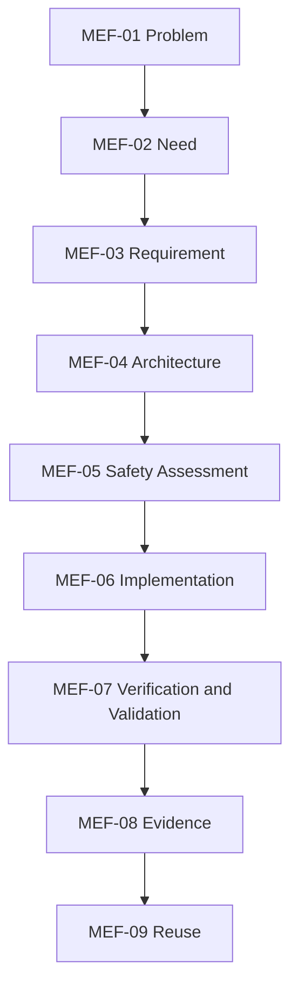

# MBSA Lab OS — Minimal Engineering Framework

## 1. Purpose

The Minimal Engineering Framework (MEF) defines a technology-neutral lifecycle for producing bounded, traceable, and evidence-based engineering results.

It supports POCs and other engineering work without replacing applicable standards, organisational processes, safety authority, or certification obligations.

## 2. Scope

The MEF defines:

- nine lifecycle stages, `MEF-01` through `MEF-09`;
- common states, entry, acceptance, transition, and reopening rules;
- minimum work products and traceability;
- tailoring levels and non-tailorable objectives;
- governance, engineering, safety, V&V, and evidence responsibilities;
- conceptual applicability to three POC candidates.

It does not select a POC, prescribe a toolchain, or authorize implementation.

## 3. Framework principles

- MEF-P01 — Govern before producing.
- MEF-P02 — Preserve the defined system boundary.
- MEF-P03 — Separate governance, engineering, safety, V&V, evidence, and publication concerns.
- MEF-P04 — Establish proportional bidirectional traceability.
- MEF-P05 — Define acceptance and decision authority explicitly.
- MEF-P06 — Remain technology-independent.
- MEF-P07 — Apply rigor proportional to risk, complexity, and decision impact.
- MEF-P08 — Iterate under configuration and change control.
- MEF-P09 — Evidence precedes claims.
- MEF-P10 — Reuse follows demonstrated applicability.
- MEF-P11 — Stay independent of one POC candidate.
- MEF-P12 — Preserve findings, limitations, and historical integrity.

## 4. Lifecycle overview

This is a nominal progression, not an irreversible waterfall. New evidence or change may reopen any affected upstream stage.

## 5. Lifecycle states

| State | Meaning |
| --- | --- |
| `PROPOSED` | Work exists but has not completed required review |
| `IN_REVIEW` | Assigned authorities are evaluating the work product |
| `ACCEPTED` | Criteria are satisfied for the stated scope and evidence |
| `BASELINED` | An accepted version is the controlled reference |
| `REOPENED` | Change or evidence invalidates or extends the accepted position |
| `REJECTED` | The work or transition is not acceptable and rationale is recorded |

These states do not replace repository, issue, safety, or release states.

## 6. Common transition contract

A stage may start when its purpose, inputs, responsibility, assumptions, constraints, and acceptance criteria are understood.

A stage may be accepted when:

- mandatory outputs exist and are coherent;
- criteria are supported by identifiable evidence;
- required upstream and downstream trace relationships exist;
- findings, assumptions, limitations, and residual risks are visible;
- the competent authority records the disposition.

Acceptance authorizes downstream work only for the accepted scope and configuration. Parallel work is allowed when dependencies and rework risk are explicit.

Reopening is considered when a requirement, interface, assumption, safety position, configuration, context of use, result, or supporting evidence changes materially.

## 7. Stage catalogue

### MEF-01 — Problem

Define a sourced, bounded, solution-neutral problem and its stakeholders.

- Minimum output: `WP-MEF-01 Problem Statement`.
- Acceptance: relevance, boundary, source, uncertainty, and assumptions are clear.
- Checkpoint: `CP-MEF-01 Problem Accepted`.

### MEF-02 — Need

Translate the accepted problem into stakeholder outcomes and validation intent.

- Minimum output: `WP-MEF-02 Need Set`.
- Acceptance: needs are stakeholder-linked, outcome-oriented, necessary, and non-duplicative.
- Checkpoint: `CP-MEF-02 Needs Accepted`.

### MEF-03 — Requirement

Define necessary, feasible, verifiable, and traceable solution constraints.

- Minimum output: `WP-MEF-03 Requirement Set` with rationale and verification-method intent.
- Acceptance: ambiguity and conflicts are controlled; requirements trace to needs, constraints, risks, or decisions.
- Checkpoint: `CP-MEF-03 Requirements Accepted`.

### MEF-04 — Architecture

Define responsibilities, structures, interfaces, allocations, alternatives, and decisions.

- Minimum output: `WP-MEF-04 Architecture Definition`.
- Acceptance: the architecture is coherent, boundary-consistent, allocated, and sufficiently defined for safety and implementation work.
- Checkpoint: `CP-MEF-04 Architecture Accepted`.

### MEF-05 — Safety Assessment

Identify safety concerns, causes, consequences, controls, assumptions, and residual uncertainty proportionally to the scope.

- Minimum output: `WP-MEF-05 Safety Assessment`.
- Acceptance: concerns and controls are traceable; limitations and residual risk are explicit; no unsupported compliance claim is made.
- Checkpoint: `CP-MEF-05 Safety Position Accepted for Scope`.

### MEF-06 — Implementation

Realize an identifiable configuration that conforms to accepted engineering inputs.

- Minimum output: `WP-MEF-06 Implementation Realization` and configuration record.
- Acceptance: realization, dependencies, deviations, setup, and readiness are reviewable.
- Checkpoint: `CP-MEF-06 Implementation Accepted for V&V`.

### MEF-07 — Verification and Validation

Evaluate conformance to requirements separately from suitability for intended use.

- Minimum output: `WP-MEF-07 V&V Results` with actual configuration, procedures, results, anomalies, and coverage.
- Acceptance: conclusions are reproducible enough for the stated claim and distinguish verification from validation.
- Checkpoint: `CP-MEF-07 V&V Position Accepted`.

### MEF-08 — Evidence

Connect Claims, Evidence, Findings, limitations, and decisions into a recoverable evidence position.

- Minimum output: `WP-MEF-08 Evidence Set` or applicable Evidence Package.
- Acceptance: every accepted claim has relevant evidence and every gap has an explicit disposition.
- Checkpoint: `CP-MEF-08 Evidence Position Accepted`.

### MEF-09 — Reuse

Assess whether knowledge is reusable beyond its originating context without overstating generality.

- Minimum output: `WP-MEF-09 Reuse Assessment` or pattern candidate.
- Acceptance: applicability, variability, dependencies, evidence, safety implications, and limitations are defined.
- Checkpoint: `CP-MEF-09 Reuse Disposition`.

MEF-09 does not admit a pattern by itself; admission follows the separate Pattern lifecycle and authority.

## 8. Minimum work-product envelope

Each controlled work product should carry, where applicable:

- identifier, title, owner, state, and version;
- purpose, scope, and intended use;
- inputs and authoritative sources;
- assumptions, constraints, and dependencies;
- content and decision rationale;
- upstream and downstream traces;
- review findings, acceptance criteria, and evidence;
- limitations, residual risks, and reopening triggers.

## 9. Change and impact management

A material change record identifies:

- source and rationale;
- affected work products, interfaces, claims, and decisions;
- safety, V&V, evidence, publication, and reuse impact;
- required rework or reopening;
- authority and resulting configuration.

No accepted downstream result remains valid automatically after an upstream change.

## 10. Tailoring model

| Level | Typical use | Expected depth |
| --- | --- | --- |
| T1 | Low-complexity bounded exploration | Concise work products and focused evidence |
| T2 | Multi-component or safety-relevant POC | Structured architecture, traceability, V&V, and evidence |
| T3 | High-impact or externally relied-upon work | Stronger independence, coverage, configuration, and review |

Tailoring may combine activities or reduce documentation detail. It must not remove these essential objectives:

- explicit problem and boundary;
- stakeholder need and verifiable criteria;
- architecture and interface reasoning;
- proportionate safety assessment;
- controlled implementation identity;
- separate verification and validation;
- traceable evidence and limitations;
- competent acceptance authority;
- controlled publication and reuse decisions where applicable.

## 11. Responsibilities

| Concern | Primary responsibility |
| --- | --- |
| Scope, priority, baseline, and acceptance | Governance Core |
| Lifecycle work products | Engineering Framework Core |
| Safety position | Safety or assurance authority |
| Test independence and conclusions | V&V authority |
| Evidence identity and traceability | Evidence and Traceability Core |
| Configuration and change | Configuration authority |
| Publication | Publication authority |
| Reuse and pattern admission | Pattern and Reuse authority |

One person may perform several roles in a small POC, but decisions and concerns remain logically distinct.

## 12. Conceptual multi-POC applicability

### 12.1 Emergency Stop Button

Provisional reference candidate for readiness analysis. The MEF can structure its safety-related input, command behaviour, architecture, failure conditions, implementation, V&V, and evidence. It is not selected or authorized to start.

### 12.2 Door Interlock Safety System

Alternative used to test applicability to state-dependent access control, sensor plausibility, actuation, and unsafe-open scenarios.

### 12.3 Overtemperature Protection System

Alternative used to test applicability to continuous sensing, thresholds, degraded states, protection actions, and environmental assumptions.

The comparison is conceptual and non-implementing. It demonstrates framework genericity, not POC readiness or success.

## 13. Risks and limitations

- The MEF is minimal and does not replace domain standards.
- Defined work products do not prove repeated operational execution.
- Tool-neutrality does not remove the need to qualify tools where required.
- Tailoring can create gaps if essential objectives are misclassified.
- POC acceptance does not imply production readiness, certification, publication, or pattern admission.

The Engineering Framework remains `PARTIAL` until repeated application and evidence demonstrate higher maturity.
