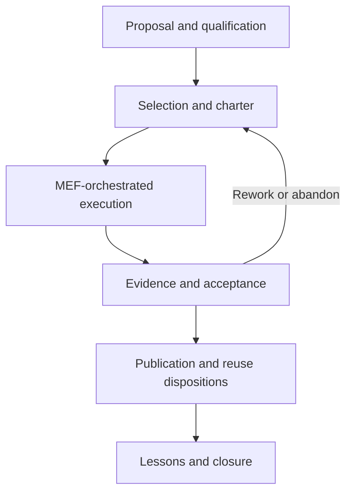

# MBSA Lab OS — POC Lifecycle and Minimal POC Factory

## 1. Document Purpose and Status

This document defines the controlled lifecycle used to govern an MBSA Lab OS
proof of concept (POC) from proposal to closure. It also defines the minimum
logical responsibilities of the POC Factory needed to make that lifecycle
repeatable, reviewable and evidence-oriented.

The document is a lifecycle and responsibility baseline. It is not evidence
that a POC has been selected, implemented, verified, published or reused. It
does not define a physical organization, a software platform, a CI/CD pipeline
or a mandatory toolchain.

Document status: **US014 candidate baseline**.

## 2. Scope and Intended Use

### 2.1 In scope

- a thirteen-phase POC lifecycle;
- controlled lifecycle states, transitions and decision outcomes;
- entry criteria, inputs, minimum activities, outputs and acceptance conditions
  for every phase;
- accountable logical responsibilities and required participants;
- orchestration of `MEF-01` through `MEF-09` without redefining them;
- minimum POC Factory responsibilities, interfaces and control artefacts;
- proportional tailoring, configuration, anomaly and change control;
- suspension, deferral, abandonment, resumption, closure and reopening;
- evidence, publication and reuse boundaries;
- conceptual applicability to three candidate POCs;
- explicit maturity limitations and downstream interfaces.

### 2.2 Out of scope

- final selection, design or implementation of a POC;
- POC-specific requirements, architecture, code or V&V results;
- a detailed traceability model, reserved for US015;
- a detailed evidence package structure, reserved for US016;
- the integrated Gate model, reserved for US017;
- pattern admission, reserved for US018;
- Sprint 3 readiness or first-POC authorization;
- physical organization, staffing, procurement, tooling or automation;
- architecture of a CI/CD pipeline, repository or database;
- unverified regulatory or standards-compliance claims;
- publication of private Strategic Control information.

### 2.3 Intended users

The lifecycle is intended for POC sponsors, governance decision authorities,
engineering leads, assurance and evidence reviewers, publication authorities,
and future pattern/reuse reviewers. A person may fulfil several roles in a
small POC, but the logical responsibilities and decision separation remain.

## 3. Authoritative Inputs and Precedence

The applicable authority order is:

1. actual Git evidence and the controlled US013 closure baseline;
2. `docs/09_Minimal_Engineering_Framework.md`;
3. `docs/08_MBSA_Lab_OS_Capability_and_Logical_Architecture.md`;
4. `docs/07_MBSA_Lab_OS_System_Context_and_Boundaries.md`;
5. governance and repository conventions in `docs/03` through `docs/06`;
6. controlled strategic planning for sequencing only;
7. Vision, Mission, Project Overview and README for general context.

The private Master Plan may inform sequencing but shall not be copied into the
public repository. A lower-authority source shall not silently override a
higher-authority source.

## 4. Inherited Architecture and Engineering Constraints

US014 preserves the following contracts:

- MBSA Lab OS remains the System of Interest;
- public and private information remain separated;
- `LC-US012-02 Governance Core` constrains lifecycle decisions;
- `LC-US012-03 Engineering Framework Core` owns the engineering lifecycle;
- `LC-US012-04 Evidence & Traceability Core` receives evidence and trace data;
- `LC-US012-05 POC Factory Logic` owns repeatable POC-production enablement;
- `LC-US012-06 Pattern & Reuse Core` receives pattern candidates only;
- `LC-US012-07 Publication Governance Gateway` controls release readiness;
- `IF-US012-02`, `IF-US012-03` and `IF-US012-04` remain authoritative logical
  exchanges;
- governance, engineering production and evidence remain distinguishable;
- publication and reuse follow adequate evidence;
- lifecycle definitions remain technology-independent;
- maturity is never inferred from an unexecuted lifecycle definition.

The Engineering Framework Core remains `PARTIAL`. POC Factory Logic remains
`STRATEGIC ONLY` until execution evidence exists.

## 5. Core Concepts and Definitions

| Term | Controlled meaning |
|---|---|
| POC | A bounded experiment intended to reduce defined uncertainty through engineering work and evidence. |
| POC proposal | An intake record describing the problem, expected learning, boundary and sponsor. |
| POC charter | The accepted control record for objective, scope, success criteria, constraints, tailoring, resources, decisions and closure. |
| Lifecycle phase | A governance-oriented segment with explicit entry, activities, outputs and acceptance conditions. |
| MEF stage | One of the nine engineering contracts defined in US013. |
| Checkpoint | A bounded readiness review within the lifecycle; it does not replace the integrated Gate model of US017. |
| Decision authority | The logical responsibility authorized to accept a transition or disposition. |
| Evidence | Recoverable information supporting a claim, observation, result or decision. |
| Pattern candidate | A potentially reusable result submitted for later assessment; it is not an admitted pattern. |
| Closure | Controlled termination with final disposition, evidence position, lessons and retention decision. |

Normative words `shall`, `should` and `may` mean mandatory requirement,
recommended practice and permitted option respectively within this baseline.

## 6. POC Lifecycle versus the Minimal Engineering Framework

The POC lifecycle and MEF address different control questions:

| Concern | POC lifecycle | MEF |
|---|---|---|
| Primary question | Should the POC start, continue, stop, publish or close? | Is the engineering work coherent and accepted? |
| Nature | Governance and pilotage | Engineering production |
| Unit of control | Whole POC and its disposition | Engineering stage and work product |
| Outputs | Charter, decisions, phase records, closure and handoffs | `WP-MEF-01` through `WP-MEF-09` |
| Authority | Governance and delegated POC authorities | Stage acceptance authorities defined by the MEF contract |
| Evidence | Decision and lifecycle evidence | Technical and assurance evidence |

The POC lifecycle orchestrates the MEF. It shall not remove a non-tailorable MEF
objective, rename MEF work products in a way that breaks traceability, or treat
a POC decision as technical proof.

## 7. Lifecycle Overview

| ID | Phase | Primary purpose | Typical exit state |
|---|---|---|---|
| PLC-01 | Proposal | Record the candidate and the uncertainty to reduce | `PROPOSED` |
| PLC-02 | Qualification | Establish eligibility, relevance and assessability | `QUALIFIED` |
| PLC-03 | Selection | Decide whether the candidate merits controlled investment | `SELECTED`, `REJECTED` or `DEFERRED` |
| PLC-04 | Framing | Baseline the charter, scope, success criteria and tailoring | `FRAMED` |
| PLC-05 | Design | Produce an accepted solution definition | `ACTIVE` |
| PLC-06 | Safety Assessment | Establish a proportionate safety position | `ACTIVE` or `BLOCKED` |
| PLC-07 | Implementation | Realize the controlled POC configuration | `IN_REVIEW` |
| PLC-08 | Verification and Validation | Evaluate conformance and usefulness separately | `IN_REVIEW` |
| PLC-09 | Evidence and Acceptance | Establish the claim-evidence position and disposition | `ACCEPTED`, `REWORK` or `ABANDONED` |
| PLC-10 | Publication Readiness | Determine whether and what may be released | `PUBLICATION_READY` or `RESTRICTED` |
| PLC-11 | Lessons Learned | Capture validated learning and limitations | `ACCEPTED` |
| PLC-12 | Pattern-Candidate Extraction | Hand off reusable candidates without admission | `ACCEPTED` |
| PLC-13 | Closure | Complete final disposition and retention | `CLOSED` |

Progression is not automatically linear. Controlled feedback may return work to
an earlier phase. Every backward transition shall identify a trigger, authority,
impacted baseline and required re-acceptance.

## 8. Controlled States and State Semantics

| State | Meaning | Minimum evidence |
|---|---|---|
| `PROPOSED` | Intake record exists; no commitment is implied | Proposal identifier and source |
| `QUALIFIED` | Eligibility and initial value/feasibility assessment are accepted | Qualification record |
| `SELECTED` | Controlled framing is authorized | Selection decision and conditions |
| `REJECTED` | Candidate is not authorized to proceed | Rationale and disposition |
| `FRAMED` | Charter, scope and tailoring are accepted | Baseline POC Charter |
| `ACTIVE` | Authorized engineering work is under way | Active configuration and plan |
| `IN_REVIEW` | Work products are awaiting a bounded decision | Review package and open findings |
| `BLOCKED` | A condition prevents authorized progress | Blocker, owner and recovery condition |
| `DEFERRED` | Work is intentionally paused before completion | Deferral rationale and review trigger |
| `ABANDONED` | Work has ended without intended acceptance | Abandonment decision and retained learning |
| `ACCEPTED` | Defined success/learning criteria have an accepted evidence position | Acceptance record and limitations |
| `PUBLICATION_READY` | Release content is authorized subject to the stated package | Classification and release decision |
| `RESTRICTED` | Publication is not authorized or is limited | Restriction and handling decision |
| `CLOSED` | Final lifecycle and retention actions are complete | Closure record |
| `REOPENED` | A closed or accepted position is invalidated or legitimately extended | Reopening decision and impact analysis |

State assignment shall not claim technical maturity beyond its evidence. For
example, `ACCEPTED` means the approved POC objective or learning criterion was
addressed; it does not mean product readiness or standards compliance.

## 9. Decision Vocabulary and Authorities

| Decision | Effect | Minimum condition | Authority |
|---|---|---|---|
| `GO` | Authorize the next bounded phase | Required inputs accepted; blocking risks absent or controlled | Governance Core or delegated accountable authority |
| `NO-GO` | Refuse progression | Critical entry, evidence, boundary or feasibility condition not met | Governance Core |
| `GO_WITH_CONDITIONS` | Progress under explicit constraints | Conditions have owners, due points and stop triggers | Governance Core or delegated authority |
| `REWORK` | Return defined work for correction | Findings are bounded and correction remains viable | Current phase acceptance authority |
| `DEFER` | Pause pending a trigger or capacity | Retention, review date/trigger and restart conditions defined | Governance Core |
| `ABANDON` | End the POC before intended acceptance | Rationale, evidence retention and stakeholder disposition complete | Governance Core |
| `RESUME` | Reactivate deferred or blocked work | Restart trigger satisfied; baseline and impact revalidated | Governance Core or delegated authority |
| `CLOSE` | Finalize the lifecycle | Closure checklist and final disposition accepted | Governance Core |
| `REOPEN` | Invalidate or extend an accepted/closed position | Trigger, scope, impact and new authority recorded | Governance Core |

A decision record shall contain at least identifier, date, subject, disposition,
authority, rationale, evidence references, conditions, limitations and impacted
configuration.

## 10. Common Phase Contract

Every phase applies the following rules:

1. Entry is permitted only when mandatory predecessor outputs are identifiable.
2. The accountable responsibility confirms scope and tailoring before work.
3. Inputs and outputs carry identifiers, state, version and ownership.
4. Assumptions, constraints, risks and anomalies remain visible.
5. Acceptance is evidence-based and records limitations or conditions.
6. A transition identifies authority, decision, destination and affected baseline.
7. Any change affecting accepted work triggers proportional impact analysis.
8. Private information is classified before any public handoff.

## 11. PLC-01 — Proposal

| Contract element | Definition |
|---|---|
| Purpose | Make a candidate visible and state the uncertainty or learning objective without implying selection. |
| Entry criteria | An identifiable source presents a problem, opportunity or hypothesis relevant to MBSA Lab OS. |
| Inputs | Source request, preliminary context, known constraints and candidate sponsor. |
| Activities | Assign an identifier; capture problem, expected learning, preliminary boundary, stakeholders, assumptions, candidate value and obvious exclusions. |
| Outputs | `WP-POC-01 POC Proposal`, initial risk flags and intake register entry. |
| Accountable | POC Factory intake responsibility. |
| Participants | Sponsor, Governance Core and Engineering Framework Core as needed. |
| MEF mapping | Initiates `MEF-01 Problem`; no MEF stage is accepted by proposal alone. |
| Acceptance | Proposal is intelligible, bounded enough to qualify and free of prohibited private-public transfer. |
| Checkpoint | `CP-POC-01 Proposal Admitted for Qualification`. |
| Evidence | Source reference, intake timestamp, identifier and admission rationale. |
| Returns/exits | Clarify, reject as invalid intake, or proceed to qualification. |

## 12. PLC-02 — Qualification

| Contract element | Definition |
|---|---|
| Purpose | Determine whether the candidate is relevant, feasible to assess and suitable for POC treatment. |
| Entry criteria | `WP-POC-01` admitted; source and sponsor identifiable. |
| Inputs | Proposal, strategic fit criteria, known dependencies, preliminary risks and comparable work. |
| Activities | Assess relevance, distinct uncertainty, observability, boundary, feasibility, expected evidence, confidentiality, dependencies and rough tailoring. |
| Outputs | `WP-POC-02 Qualification Record`, recommendation and unresolved questions. |
| Accountable | POC Factory qualification responsibility. |
| Participants | Governance, engineering, evidence and publication responsibilities as required. |
| MEF mapping | Elaborates `MEF-01`; may begin `MEF-02 Need` exploration without acceptance. |
| Acceptance | Relevance, assessability, major constraints and a defensible recommendation are documented. |
| Checkpoint | `CP-POC-02 Qualification Accepted`. |
| Evidence | Completed qualification criteria and rationale. |
| Returns/exits | Request clarification, qualify, reject or defer. |

## 13. PLC-03 — Selection

| Contract element | Definition |
|---|---|
| Purpose | Make an explicit investment and priority decision without pretending technical feasibility is proven. |
| Entry criteria | Qualification record accepted and comparison basis available. |
| Inputs | Qualified proposal, portfolio constraints, value, uncertainty, risk, evidence potential and resource envelope. |
| Activities | Compare candidates, test boundary and confidentiality, evaluate opportunity cost, record conditions and decide disposition. |
| Outputs | `WP-POC-03 Selection Decision`, priority and conditions. |
| Accountable | Governance Core. |
| Participants | Sponsor and POC Factory; engineering/evidence reviewers consulted. |
| MEF mapping | Selection authorizes controlled MEF work; it accepts no technical work product. |
| Acceptance | Decision is authorized, rationalized, recoverable and linked to the qualified proposal. |
| Checkpoint | `CP-POC-03 Selection Disposition`. |
| Evidence | Decision record and comparison criteria. |
| Returns/exits | `SELECTED`, `REJECTED` or `DEFERRED`. |

## 14. PLC-04 — Framing

| Contract element | Definition |
|---|---|
| Purpose | Establish the controlled POC Charter and executable boundary. |
| Entry criteria | Selection decision is `GO` or `GO_WITH_CONDITIONS`. |
| Inputs | Selection conditions, proposal, qualification, constraints and initial MEF work. |
| Activities | Define objectives, learning questions, IN/OUT boundary, success and stop criteria, assumptions, stakeholders, tailoring, work products, configuration, evidence strategy, decision cadence and closure conditions. |
| Outputs | `WP-POC-04 POC Charter` and `WP-POC-04A Tailoring Record`. |
| Accountable | POC Lead responsibility under Governance Core approval. |
| Participants | Engineering, evidence, safety, V&V and publication responsibilities. |
| MEF mapping | Baselines `MEF-01` and frames `MEF-02` and `MEF-03`. |
| Acceptance | Charter is measurable, bounded, resourced at a conceptual level and consistent with US011–US013. |
| Checkpoint | `CP-POC-04 Charter Accepted`. |
| Evidence | Approved charter, tailoring rationale and configuration baseline. |
| Returns/exits | Rework framing, defer, abandon or enter active design. |

## 15. PLC-05 — Design

| Contract element | Definition |
|---|---|
| Purpose | Define a solution capable of addressing the chartered learning objective. |
| Entry criteria | Charter accepted; applicable problem, need and requirement work controlled. |
| Inputs | `WP-MEF-01` through `WP-MEF-03`, POC Charter and change records. |
| Activities | Develop the architecture definition, allocations, interfaces, decisions, verification needs and implementation boundary; review against scope and success criteria. |
| Outputs | `WP-MEF-04 Architecture Definition`, design decisions and updated POC control records. |
| Accountable | Engineering Lead responsibility. |
| Participants | POC Lead, safety, V&V, evidence and configuration responsibilities. |
| MEF mapping | Executes `MEF-02`, `MEF-03` and `MEF-04`; feeds `MEF-05`. |
| Acceptance | Architecture and requirements are coherent, traceable at the defined level and implementable within the POC boundary. |
| Checkpoint | `CP-POC-05 Design Position Accepted`. |
| Evidence | Accepted MEF checkpoints, decisions, interface definition and review findings. |
| Returns/exits | Rework requirements/design, reframe, defer or proceed to safety position. |

## 16. PLC-06 — Safety Assessment

| Contract element | Definition |
|---|---|
| Purpose | Establish a proportionate safety position for the POC scope without unsupported compliance claims. |
| Entry criteria | Problem, boundary, requirements and architecture are sufficiently defined. |
| Inputs | Charter, architecture, operating assumptions, hazards/concerns and intended V&V. |
| Activities | Identify hazards or safety concerns; assess consequences proportionately; derive controls; record assumptions; connect controls to requirements, implementation and V&V. |
| Outputs | `WP-MEF-05 Safety Assessment`, safety conditions and POC decision recommendation. |
| Accountable | Safety Assessment responsibility. |
| Participants | Engineering Lead, POC Lead, V&V and Governance Core. |
| MEF mapping | Executes `MEF-05` and may reopen `MEF-02` through `MEF-04`. |
| Acceptance | Safety position is reviewable, bounded, linked to controls and adequate for the intended experiment. |
| Checkpoint | `CP-POC-06 Safety Position Accepted for POC Scope`. |
| Evidence | Concern/hazard log, derived controls, assumptions and review record. |
| Returns/exits | Rework, block, reframe, abandon or authorize implementation. |

## 17. PLC-07 — Implementation

| Contract element | Definition |
|---|---|
| Purpose | Realize the controlled configuration required for the experiment. |
| Entry criteria | Architecture and proportionate safety position accepted; implementation authorization recorded. |
| Inputs | Accepted design baseline, controls, configuration rules and V&V readiness needs. |
| Activities | Build/configure the realization; maintain configuration identity; record deviations, anomalies and setup; perform implementation review. |
| Outputs | `WP-MEF-06 Implementation Realization` and configuration record. |
| Accountable | Implementation responsibility. |
| Participants | Engineering Lead, configuration, safety, V&V and evidence responsibilities. |
| MEF mapping | Executes `MEF-06`; changes may reopen `MEF-03` through `MEF-05`. |
| Acceptance | Realization is identifiable, reviewable and ready for the approved V&V scope. |
| Checkpoint | `CP-POC-07 Implementation Ready for V&V`. |
| Evidence | Configuration identity, build/setup record, deviations and readiness review. |
| Returns/exits | Correct, rework design, block, abandon or proceed to V&V. |

## 18. PLC-08 — Verification and Validation

| Contract element | Definition |
|---|---|
| Purpose | Determine separately whether the realization meets specified requirements and whether it addresses the intended need/learning objective. |
| Entry criteria | Identified implementation configuration and accepted V&V scope are available. |
| Inputs | Requirements, architecture, safety controls, realization, cases, expected results and success criteria. |
| Activities | Confirm readiness; execute controlled cases; capture actual results; separate verification from validation; record coverage, anomalies and limitations. |
| Outputs | `WP-MEF-07 V&V Results`, anomaly records and POC success-criterion assessment. |
| Accountable | V&V Lead responsibility. |
| Participants | Engineering, implementation, safety, evidence and POC Lead responsibilities. |
| MEF mapping | Executes `MEF-07`; findings may reopen any affected upstream stage. |
| Acceptance | Results are reproducible enough for the POC claim, actual configuration is identified and conclusions distinguish verification from validation. |
| Checkpoint | `CP-POC-08 V&V Conclusion Reviewed`. |
| Evidence | Executed cases, observations, results, coverage, anomalies and conclusions. |
| Returns/exits | Rework, rerun, accept limitations, abandon or proceed to evidence assessment. |

## 19. PLC-09 — Evidence and Acceptance

| Contract element | Definition |
|---|---|
| Purpose | Evaluate whether the POC claims and learning objectives are adequately supported. |
| Entry criteria | V&V conclusion reviewed; relevant lifecycle records recoverable. |
| Inputs | MEF work products, decision records, configuration, results, anomalies, limitations and trace information. |
| Activities | Assemble the minimum evidence view; map claims to evidence; identify gaps; assess success, useful learning and residual uncertainty; recommend disposition. |
| Outputs | `WP-MEF-08 Evidence Set`, `WP-POC-09 Acceptance Record` and limitations. |
| Accountable | Evidence & Traceability responsibility for evidence position; Governance Core for acceptance. |
| Participants | POC Lead, engineering, V&V, safety and publication responsibilities. |
| MEF mapping | Executes `MEF-08`; does not pre-empt the detailed US016 package. |
| Acceptance | Every accepted claim has an evidence reference and limitation; gaps have an explicit disposition. |
| Checkpoint | `CP-POC-09 POC Evidence and Acceptance Disposition`. |
| Evidence | Claim-evidence view, trace status, gap log and signed decision. |
| Returns/exits | `ACCEPTED`, `GO_WITH_CONDITIONS`, `REWORK` or `ABANDONED`. |

## 20. PLC-10 — Publication Readiness and Controlled Publication

| Contract element | Definition |
|---|---|
| Purpose | Decide whether a bounded public package is accurate, authorized and free of prohibited information. |
| Entry criteria | Evidence/acceptance disposition exists; proposed release content is identified. |
| Inputs | Candidate release package, evidence position, classification, rights/provenance and limitations. |
| Activities | Check public/private boundary, claim accuracy, evidence support, confidential content, attribution, limitations and release channel constraints. |
| Outputs | `WP-POC-10 Publication Readiness Decision` and authorized release boundary. |
| Accountable | Publication Governance Gateway with Governance Core authorization. |
| Participants | Evidence, POC Lead, engineering and Strategic Control Bridge as required. |
| MEF mapping | Consumes `MEF-08`; publication is not a MEF stage. |
| Acceptance | Release decision states exactly what may be published, under which limitations and evidence references. |
| Checkpoint | `CP-POC-10 Publication Disposition`. |
| Evidence | Classification review, release decision and content identifier. |
| Returns/exits | Publish authorized subset, restrict, rework package or do not publish. |

## 21. PLC-11 — Lessons Learned

| Contract element | Definition |
|---|---|
| Purpose | Capture validated learning, failed assumptions, process observations and unresolved uncertainty. |
| Entry criteria | A material result or termination disposition exists. |
| Inputs | Charter, decisions, work products, results, anomalies, changes, effort observations and stakeholder feedback. |
| Activities | Compare expected and actual learning; identify causal factors; distinguish fact, interpretation and recommendation; record applicability limits. |
| Outputs | `WP-POC-11 Lessons-Learned Record`. |
| Accountable | POC Lead responsibility. |
| Participants | All producing and reviewing responsibilities. |
| MEF mapping | Provides feedback to all affected MEF stages and informs `MEF-09`. |
| Acceptance | Learning statements are evidence-linked, scoped and actionable or explicitly informational. |
| Checkpoint | `CP-POC-11 Learning Accepted`. |
| Evidence | Review record and references to actual observations. |
| Returns/exits | Clarify learning, reopen affected work, or proceed to reuse assessment. |

## 22. PLC-12 — Pattern-Candidate Extraction

| Contract element | Definition |
|---|---|
| Purpose | Identify potentially reusable knowledge without declaring an admitted pattern. |
| Entry criteria | Evidence and lessons support a bounded reusable proposition. |
| Inputs | Accepted evidence position, lessons, architecture/engineering assets and applicability limits. |
| Activities | Identify candidate; define context, problem, proposed solution, evidence, limitations, variability and adaptation needs; submit for later governance. |
| Outputs | `WP-MEF-09 Reuse Assessment` and `WP-POC-12 Pattern-Candidate Handoff`. |
| Accountable | Pattern & Reuse Core for candidate receipt; POC Factory for handoff quality. |
| Participants | Engineering, evidence and Governance Core. |
| MEF mapping | Executes the POC-bounded portion of `MEF-09`; pattern admission remains outside US014. |
| Acceptance | Candidate is traceable to evidence and contains no claim of general applicability beyond assessment. |
| Checkpoint | `CP-POC-12 Reuse Disposition`. |
| Evidence | Applicability matrix, limitation record and handoff decision. |
| Returns/exits | Rework candidate, retain as local learning, submit or decline submission. |

## 23. PLC-13 — Closure

| Contract element | Definition |
|---|---|
| Purpose | Complete final disposition, retention, communication and accountability for the POC. |
| Entry criteria | Acceptance or termination disposition exists; mandatory downstream handoffs are addressed. |
| Inputs | Charter, configuration, decisions, evidence position, publication disposition, lessons, reuse disposition and open items. |
| Activities | Confirm final state; reconcile open items; record retained artefacts, ownership and access; communicate limitations; capture metrics; authorize closure. |
| Outputs | `WP-POC-13 Closure Record` and final register update. |
| Accountable | Governance Core. |
| Participants | POC Factory, POC Lead, engineering, evidence, publication and reuse responsibilities. |
| MEF mapping | Confirms disposition of `MEF-01` through `MEF-09`; closure is not an additional MEF stage. |
| Acceptance | No lifecycle obligation is silently open; evidence, limitations, retention and reopening triggers are explicit. |
| Checkpoint | `CP-POC-13 POC Closed`. |
| Evidence | Closure checklist, disposition decision, retained configuration and open-item ownership. |
| Returns/exits | `CLOSED`, or rework/reopen a specifically affected phase. |

## 24. Lifecycle-to-MEF Mapping

| POC phase | MEF-01 | MEF-02 | MEF-03 | MEF-04 | MEF-05 | MEF-06 | MEF-07 | MEF-08 | MEF-09 |
|---|---:|---:|---:|---:|---:|---:|---:|---:|---:|
| PLC-01 Proposal | I |  |  |  |  |  |  |  |  |
| PLC-02 Qualification | W | I |  |  |  |  |  |  |  |
| PLC-03 Selection | G | G |  |  |  |  |  |  |  |
| PLC-04 Framing | A | W | I |  |  |  |  | I |  |
| PLC-05 Design | R | A | A | A | I |  | I | I |  |
| PLC-06 Safety Assessment | R | R | R | R | A |  | I | I |  |
| PLC-07 Implementation |  |  | R | R | R | A | I | I |  |
| PLC-08 Verification and Validation |  | R | R | R | R | R | A | W |  |
| PLC-09 Evidence and Acceptance | R | R | R | R | R | R | A | A | I |
| PLC-10 Publication Readiness |  |  |  |  |  |  |  | G |  |
| PLC-11 Lessons Learned | F | F | F | F | F | F | F | F | I |
| PLC-12 Pattern-Candidate Extraction |  |  |  |  |  |  |  | R | A |
| PLC-13 Closure | D | D | D | D | D | D | D | D | D |

Legend: `I` initiated, `W` worked, `A` acceptance expected, `R` may be reopened,
`G` governance authorization, `F` feedback destination, `D` final disposition.

This matrix is orchestration guidance, not a substitute for the detailed MEF
entry and acceptance rules.

## 25. Minimal POC Factory Responsibilities

| ID | Logical responsibility | Minimum obligation | Primary interfaces |
|---|---|---|---|
| PF-01 | Intake and register control | Identify every proposal and maintain its status/disposition | Governance Core, sponsor |
| PF-02 | Qualification coordination | Apply consistent relevance, feasibility, risk and evidence criteria | Engineering, Evidence, Governance |
| PF-03 | Selection support | Provide comparable decision information without taking the governance decision | Governance Core |
| PF-04 | Charter and scope control | Maintain accepted objective, boundary, conditions, success/stop criteria and tailoring | Engineering Framework Core |
| PF-05 | MEF orchestration | Ensure applicable MEF stages/work products are planned and dispositioned | Engineering Framework Core |
| PF-06 | Configuration coordination | Keep POC artefacts and implementation/result configurations identifiable | Evidence & Traceability Core |
| PF-07 | Change and anomaly coordination | Route impact analysis, decisions, rework and closure of findings | Governance, Engineering, Evidence |
| PF-08 | Readiness coordination | Establish bounded readiness for implementation, V&V, acceptance and publication | Safety, V&V, Publication Gateway |
| PF-09 | Evidence handoff | Ensure evidence outputs and limitations reach the evidence responsibility | Evidence & Traceability Core |
| PF-10 | Learning and reuse handoff | Capture lessons and submit pattern candidates with applicability limits | Pattern & Reuse Core |
| PF-11 | Termination and continuity control | Control block, defer, abandon, resume, close and reopen dispositions | Governance Core |
| PF-12 | Retention and logical archive coordination | Record retained artefacts, ownership, classification and retrieval references | Governance, Evidence, Publication |

The POC Factory shall not approve its own unsupported claims, replace technical
acceptance authorities, own private Strategic Control content, or imply that
these responsibilities require a dedicated physical team or platform.

## 26. Logical Interfaces and Control Flows

### 26.1 Governance decision and baseline

Through `IF-US012-02`, the POC Factory submits qualification, charter, readiness,
acceptance and closure information. Governance returns dispositions, conditions
and baseline authority. Each exchange carries decision and configuration IDs.

### 26.2 Engineering work-product exchange

Through `IF-US012-03`, the POC Factory coordinates the availability and state of
MEF work products. The Engineering Framework Core retains lifecycle semantics;
the POC Factory retains POC sequencing and readiness coordination.

### 26.3 Evidence and trace-link exchange

Through `IF-US012-04`, producing responsibilities submit evidence metadata,
actual results, trace references, anomalies and limitations. The Evidence &
Traceability Core returns evidence position and gap information.

### 26.4 Publication and reuse handoffs

Only accepted, classified and appropriately evidenced material may cross to the
Publication Governance Gateway. A pattern candidate crosses to Pattern & Reuse
Core with evidence and applicability limitations; submission is not admission.

### 26.5 End-to-end control flow

## 27. Tailoring and Proportionality

US014 reuses the MEF tailoring levels:

| Level | POC use | Expected control intensity |
|---|---|---|
| `T1 — Lightweight` | Narrow uncertainty, low consequence, few interfaces and reversible realization | Compact charter and combined reviews are permitted when objectives remain explicit |
| `T2 — Standard` | Multiple requirements/interfaces or meaningful V&V and evidence needs | Full phase coverage with proportionate work products and separate key decisions |
| `T3 — Enhanced` | Safety significance, high uncertainty, difficult reversibility or broad publication/reuse claims | Stronger independence, review depth, configuration control and evidence rigor |

Tailoring may combine documentation or reviews. It shall not remove:

- a stated problem and need;
- explicit success, stop and acceptance criteria;
- requirements and architecture adequate to the claim;
- proportionate safety reasoning;
- identified implementation configuration;
- separate verification and validation conclusions;
- evidence-based claims and limitations;
- controlled acceptance, publication and closure decisions.

`WP-POC-04A` records level, rationale, combined activities, omitted detail,
compensating controls, approval and triggers for escalation.

## 28. Configuration, Change, Anomaly and Reopening Control

The minimum POC configuration identifies the current charter, accepted MEF work
products, implementation realization, V&V configuration, evidence position,
decision records and release candidate, when applicable.

Every material change record shall contain:

- trigger and requested change;
- affected objective, phase, work product and configuration;
- impact on boundary, requirements, architecture, safety, V&V and evidence;
- public/private impact;
- decision and authority;
- required rework, re-acceptance and transition;
- final implementation/disposition state.

An anomaly is not closed merely because the POC proceeds. It shall be corrected,
accepted with limitation, deferred with ownership, or made a reason to block or
abandon. Reopening is mandatory when new information invalidates an accepted
claim, success criterion, safety assumption, configuration identity or release
decision.

## 29. Suspension, Deferral, Abandonment and Resumption

| Disposition | Required record | Resume/restart condition |
|---|---|---|
| Block | Blocking condition, impact, owner and recovery evidence | Condition removed and affected baseline rechecked |
| Defer | Rationale, retained state, review trigger/date, ownership and obsolescence risks | Governance confirms trigger and continued relevance |
| Abandon | Rationale, partial evidence, limitations, retained learning, communication and archive disposition | New proposal or explicit reopening with new impact analysis |
| Resume | Trigger satisfaction, current baseline, change since pause, resources and updated risks | `RESUME` decision and revalidated entry criteria |
| Reopen | Invalidated/extended position, affected claims and configuration, scope and plan | `REOPEN` decision and controlled return phase |

No suspended POC remains implicitly active. Time-based obsolescence, dependency
changes and baseline drift shall be assessed before resumption.

## 30. Evidence, Acceptance, Publication and Reuse Boundaries

- A successful demonstration is an observation, not sufficient evidence by
  itself for all POC claims.
- A technically unsuccessful result may still satisfy a learning objective if
  the experiment and evidence are valid.
- Useful learning does not convert a failed requirement into a pass.
- Acceptance is limited to the chartered objectives and recorded configuration.
- Publication requires a separate classification and release decision.
- Reuse requires an applicability assessment and shall not inherit evidence
  beyond its demonstrated context.
- Pattern-candidate status is not pattern admission.
- Public material shall exclude private strategy, credentials, personal data,
  restricted supplier information and unsupported claims.

US015 will refine trace-link semantics, US016 will refine the evidence package,
US017 will define the integrated Gate model and US018 will govern pattern
admission. This document provides bounded interfaces, not those implementations.

## 31. Conceptual Multi-POC Applicability Assessment

### 31.1 Emergency Stop Button

| Dimension | Conceptual application |
|---|---|
| Learning focus | Whether a bounded stop-command concept can achieve defined response and observable safe-state behaviour |
| Likely tailoring | `T2`, potentially `T3` if the experiment claims safety-relevant behaviour |
| Critical phases | Framing, Safety Assessment, Implementation configuration, V&V and Evidence |
| Example stop criterion | Unsafe or indeterminate response path prevents controlled experimentation |
| Evidence emphasis | Response observations, state-transition results, configuration and limitations |
| Boundary | No product safety or normative compliance claim is implied |

### 31.2 Door Interlock Safety System

| Dimension | Conceptual application |
|---|---|
| Learning focus | Whether door-state and operating-state constraints can be represented and evaluated coherently |
| Likely tailoring | `T2` because multiple states, interfaces and negative scenarios are expected |
| Critical phases | Qualification, Requirements, Architecture, Safety Assessment and scenario-based V&V |
| Example stop criterion | State observability or authoritative door/motion input cannot be established within scope |
| Evidence emphasis | State matrix, interface assumptions, prohibited-transition results and anomaly handling |
| Boundary | No physical vehicle integration or homologation claim is implied |

### 31.3 Overtemperature Protection System

| Dimension | Conceptual application |
|---|---|
| Learning focus | Whether sensing, threshold, persistence and protective-response logic can be evaluated under controlled stimuli |
| Likely tailoring | `T2`; `T3` if irreversible or hazardous physical effects enter scope |
| Critical phases | Framing, architecture, safety assumptions, stimulus configuration and V&V repeatability |
| Example stop criterion | Temperature stimulus or sensor behaviour cannot be controlled or bounded safely |
| Evidence emphasis | Calibration/configuration identity, threshold cases, timing, recovery and fault observations |
| Boundary | A simulated or otherwise safe experimental boundary is required |

### 31.4 Genericity conclusion

All three candidates can use the same thirteen phases, state model, decision
vocabulary, factory responsibilities and MEF orchestration. They differ in
hazards, observability, interfaces, V&V cases and tailoring intensity. Therefore
the lifecycle is not specialized to the Emergency Stop Button. This assessment
does not select a candidate or prove feasibility.

## 32. Governance and Maturity Limitations

| Element | Position after US014 definition | Evidence still required |
|---|---|---|
| POC lifecycle definition | Defined, pending repository acceptance | Execution on a real POC |
| Minimal POC Factory responsibilities | Defined logically | Demonstrated operation and metrics |
| Engineering Framework Core | `PARTIAL` | Applied MEF work products and checkpoints |
| Evidence & Traceability Core | `PARTIAL` | US015/US016 detail and execution evidence |
| POC Factory Logic | `STRATEGIC ONLY` | Selected and executed POC lifecycle |
| Pattern & Reuse Core | `STRATEGIC ONLY` | Admitted patterns and reuse evidence |
| Publication Gateway | `PARTIAL` | Repeated evidence-based release decisions |

No operational readiness, throughput, quality level, safety integrity or
compliance claim follows from this document.

## 33. Acceptance Criteria Compliance Matrix

| AC | Coverage | Candidate result |
|---|---|---|
| AC-US014-01 | Sections 3–4 | PASS |
| AC-US014-02 | Sections 4, 25–26 | PASS |
| AC-US014-03 | Sections 6, 11–24 | PASS |
| AC-US014-04 | Sections 1–2, 7, 25 | PASS |
| AC-US014-05 | Section 6 | PASS |
| AC-US014-06 | Sections 7, 11–23 | PASS |
| AC-US014-07 | Sections 11–23: purpose and entry criteria | PASS |
| AC-US014-08 | Sections 11–23: inputs, activities and outputs | PASS |
| AC-US014-09 | Sections 11–23: accountable and participants | PASS |
| AC-US014-10 | Section 24 | PASS |
| AC-US014-11 | Sections 11–23: acceptance and evidence | PASS |
| AC-US014-12 | Sections 5, 11–23 | PASS |
| AC-US014-13 | Sections 8–10 | PASS |
| AC-US014-14 | Section 9 | PASS |
| AC-US014-15 | Sections 8–9 and 28–29 | PASS |
| AC-US014-16 | Sections 14, 27–28 | PASS |
| AC-US014-17 | Section 28 | PASS |
| AC-US014-18 | Section 25 | PASS |
| AC-US014-19 | Sections 4 and 26 | PASS |
| AC-US014-20 | Sections 16, 18 and 30 | PASS |
| AC-US014-21 | Sections 19–20 and 30 | PASS |
| AC-US014-22 | Sections 21–22 and 30 | PASS |
| AC-US014-23 | Section 31.1 | PASS |
| AC-US014-24 | Sections 31.2–31.3 | PASS |
| AC-US014-25 | Section 31.4 | PASS |
| AC-US014-26 | Sections 1–2 and 31 | PASS |
| AC-US014-27 | Sections 1–2 and 25 | PASS |
| AC-US014-28 | Section 32 | PASS |
| AC-US014-29 | Sections 3–4, 20 and 30 | PASS |
| AC-US014-30 | Sections 33–35; repository evidence remains pending | PENDING GIT VERIFICATION |

The matrix records document-content coverage. Final AC verdicts remain subject
to controlled review and Git evidence; this candidate matrix does not close
US014.

## 34. Risks, Assumptions and Open Points

### 34.1 Assumptions

- a POC is used to reduce bounded uncertainty, not to bypass product governance;
- roles are logical responsibilities and may be combined proportionately;
- future US015–US018 will refine the bounded interfaces defined here;
- candidate-specific engineering will apply the authoritative MEF baseline;
- actual execution evidence will be retained in controlled locations.

### 34.2 Risks and mitigations

| Risk | Consequence | Mitigation |
|---|---|---|
| Lifecycle confused with MEF | Duplicate or contradictory engineering control | Preserve Section 6 distinction and mapping in Section 24 |
| Phase inflation | Excess process for small POCs | Apply T1/T2/T3 while preserving non-tailorable objectives |
| Gate semantics implemented prematurely | Conflict with US017 | Use bounded checkpoints and decision vocabulary only |
| Demo treated as evidence of readiness | Inflated maturity claim | Apply evidence, acceptance and limitation rules in Sections 19 and 30 |
| Factory treated as a tool/team | Premature physical design | Maintain logical-responsibility definition in Section 25 |
| Pattern candidate treated as reusable pattern | Unsafe or misleading reuse | Require later applicability and admission governance |
| Private strategy copied publicly | Confidentiality breach | Apply source hierarchy and publication review |
| Deferred POC silently becomes stale | Invalid restart baseline | Require review trigger and resumption impact analysis |

### 34.3 Open points deliberately deferred

- trace-link identifiers and cardinalities: US015;
- evidence package schema and mandatory evidence classes: US016;
- integrated Gate catalogue and authorities: US017;
- pattern admission and lifecycle: US018;
- first candidate selection/readiness: later explicit authorization.

## 35. Verification Strategy and Document Governance

### 35.1 Content verification

Verify that:

- thirteen and only thirteen minimum phases are defined;
- every phase contains all common contract elements;
- every phase maps to MEF stages without redefining them;
- all required states and decisions are present;
- POC Factory responsibilities cover intake through closure;
- multi-POC assessment remains conceptual;
- no physical architecture, tool selection or unsupported compliance claim exists;
- all 30 Acceptance Criteria have explicit coverage.

### 35.2 Repository verification

The controlled implementation shall verify:

- the sole repository change is this document;
- UTF-8 without BOM, NUL-free and LF-only text;
- no trailing whitespace;
- `git diff --check` and `git diff --cached --check` pass;
- staged path and statistics match the intended scope;
- real commit, merge and remote SHAs are captured;
- the final working tree is clean.

### 35.3 Change control

Changes that alter lifecycle phases, MEF mapping, decision authority,
public/private handling, acceptance semantics or downstream allocations require
impact analysis and controlled approval. Editorial corrections may use the
normal repository workflow when they do not change the baseline meaning.

### 35.4 Conclusion

This baseline defines a complete, technology-independent POC lifecycle and the
minimum logical POC Factory responsibilities needed to orchestrate controlled
POC work. It preserves the US011 boundaries, US012 logical architecture and
US013 engineering framework. Operational maturity remains unclaimed until the
lifecycle is executed and evidenced on an authorized POC.
