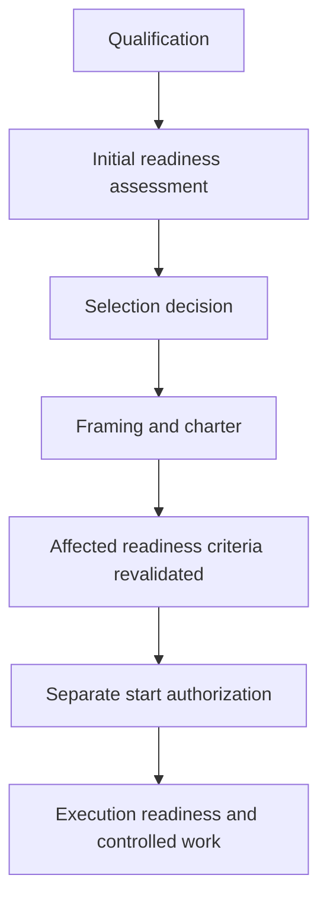
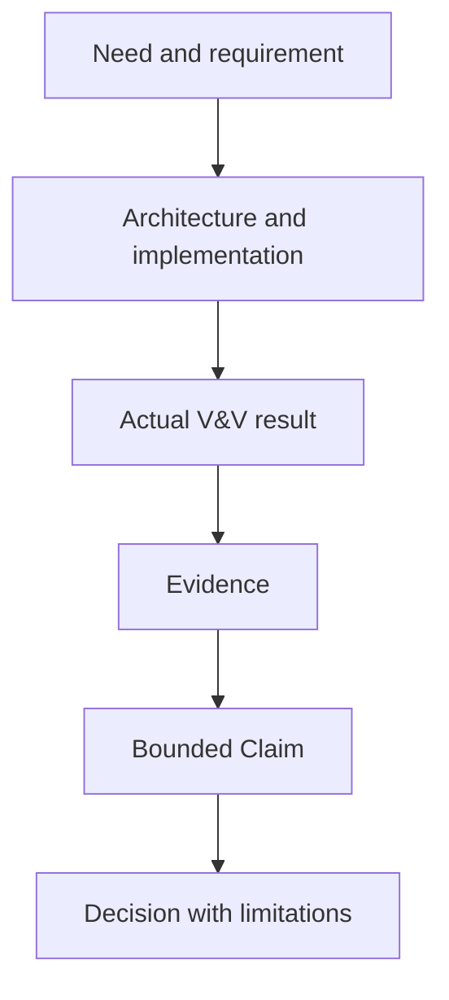

# MBSA Lab OS — Architecture Coherence Review and Freeze

## 1. Purpose

This document records the coherence review and bounded architecture-freeze
decision for the public MBSA Lab OS engineering foundation.

The review determines whether the public context, capabilities, logical
architecture, engineering lifecycle, POC lifecycle, traceability, evidence,
quality gates, Pattern rules, communication interface, and first-POC readiness
framework form a sufficiently coherent basis for controlled evolution.

An architecture freeze stabilizes the reviewed contracts. It does not prove
implementation, operational maturity, safety, certification, POC success,
Pattern admission, publication readiness, or authorization to start a POC.

## 2. Decision

The public MBSA Lab OS architecture is:

> **FREEZE APPROVED WITH LIMITATIONS**

The decision applies to the conceptual and logical architecture described by
the reviewed public source set. It is supported by coherent responsibility,
interface, lifecycle, evidence, authority, and maturity boundaries.

The limitations in Section 17 remain mandatory. They do not invalidate the
overall architecture, but they constrain use of the Pattern template, clarify
canonical terminology, and define reopening obligations.

This decision does not establish a new external release version and does not
authorize implementation or execution work.

## 3. Reviewed public source set

The freeze review covers the following public sources:

| Source | Architectural responsibility |
| --- | --- |
| [README](../README.md) | Public entry point, scope, maturity boundary, and navigation |
| [Project Overview](00_Project_Overview.md) | Project scope, target capabilities, lifecycle, and non-claims |
| [Vision](01_Vision.md) | Long-term direction and evidence-based identity |
| [Mission](02_Mission.md) | Recurring engineering mission and value chain |
| [Engineering Governance](03_Engineering_Governance.md) | Decision, evidence, authority, change, and publication principles |
| [Git Workflow and Versioning](04_Git_Workflow_and_Versioning.md) | Public configuration, baseline, release, and history rules |
| [Repository and Documentation Conventions](05_Repository_and_Documentation_Conventions.md) | Public information architecture, text policy, and documentation rules |
| [Foundational Governance Baseline](06_Sprint_1_Closure_and_Governance_Baseline.md) | Public governance foundation and non-regression rules |
| [System Context and Boundaries](07_MBSA_Lab_OS_System_Context_and_Boundaries.md) | System of interest, actors, boundaries, trust points, and principal flows |
| [Capability and Logical Architecture](08_MBSA_Lab_OS_Capability_and_Logical_Architecture.md) | Canonical capabilities, logical components, interfaces, flows, and maturity |
| [Minimal Engineering Framework](09_Minimal_Engineering_Framework.md) | Engineering lifecycle stages, work products, tailoring, and authority |
| [POC Lifecycle and Minimal POC Factory](10_POC_Lifecycle_and_Minimal_POC_Factory.md) | POC phases, states, decisions, handoffs, closure, and reopening |
| [Traceability Model](11_Traceability_Model.md) | Traceable elements, link semantics, coverage, baselines, and impact |
| [Evidence Package Model](12_Evidence_Package_Model.md) | Evidence, Claims, Findings, limitations, provenance, and package lifecycle |
| [Integrated Quality Gates Model](13_Integrated_Quality_Gates_Model.md) | Canonical Gate families, criteria, decisions, conditions, and authority |
| [Pattern Definition and Admission Rules](14_Pattern_Definition_and_Admission_Rules.md) | Canonical Pattern obligations, states, decisions, admission, and reuse |
| [Video Factory Minimal Interface](15_Video_Factory_Minimal_Interface.md) | Controlled communication source, review, release, and lifecycle interface |
| [First POC Readiness Framework](16_First_POC_Readiness_Framework.md) | Readiness criteria, states, conditions, stop triggers, and candidate comparison |
| [Pattern Template](../templates/MBSA_Lab_Pattern_Template.md) | Non-authoritative authoring structure subject to the limitations in Section 17 |

Numbering supports navigation. Authority is assigned by concept, not by numeric
order. When two documents describe the same concept, the authority map in
Section 6 governs interpretation.

## 4. Review scope

The review evaluates:

- system context, physical and logical boundaries, and public/private trust;
- capability outcomes, logical responsibilities, interfaces, dependencies, and
  end-to-end flows;
- relationships between the engineering framework and POC lifecycle;
- traceability, Evidence Packages, Claims, Findings, limitations, and decisions;
- integrated Gate families, checkpoints, states, conditions, and authorities;
- Pattern candidacy, admission, applicability, and target reuse;
- communication, video production, release, correction, and withdrawal;
- readiness, selection, framing, start authorization, execution, and acceptance;
- tailoring, configuration, change impact, supersession, and reopening;
- conceptual applicability to the three initial POC candidates;
- maturity claims, limitations, public non-claims, and overstatement risk.

The review does not evaluate a detailed product design, implementation, test
execution, safety case, production environment, certification package, or tool
qualification.

## 5. Evaluation principles

The architecture is considered coherent when:

1. each material responsibility has an identifiable owner or authority;
2. overlapping documents have explicit conceptual authority;
3. lifecycle states and decision states are not conflated;
4. interfaces exchange identified information without transferring authority
   silently;
5. evidence, claims, findings, limitations, and decisions retain direction and
   configuration;
6. public/private separation preserves useful engineering meaning while
   excluding protected or administrative content;
7. maturity never exceeds demonstrated evidence;
8. unresolved discrepancies are visible, bounded, owned, and subject to
   reopening.

Coherence does not require every lifecycle to use the same state vocabulary.
MEF stages, POC phases, Gate records, Evidence Packages, readiness records,
Pattern records, and releases are different controlled objects. Their states
remain intentionally distinct.

## 6. Canonical authority map

| Concept | Canonical public authority | Interpretation rule |
| --- | --- | --- |
| System of interest and trust boundary | [System Context and Boundaries](07_MBSA_Lab_OS_System_Context_and_Boundaries.md) | The repository represents MBSA Lab OS publicly but is not the whole system |
| Capability, logical component, interface, and flow identities | [Capability and Logical Architecture](08_MBSA_Lab_OS_Capability_and_Logical_Architecture.md) | `CAP-*`, `LC-*`, `IF-*`, and `FL-*` names and meanings originate here |
| Engineering stages and minimum work products | [Minimal Engineering Framework](09_Minimal_Engineering_Framework.md) | `MEF-*`, `WP-MEF-*`, and `CP-MEF-*` describe engineering content progression |
| POC phases, states, and lifecycle decisions | [POC Lifecycle and Minimal POC Factory](10_POC_Lifecycle_and_Minimal_POC_Factory.md) | `PLC-*`, POC states, and phase decisions govern one bounded POC |
| Trace elements and relation semantics | [Traceability Model](11_Traceability_Model.md) | `TRL-*` direction and endpoint semantics are normative for public traceability |
| Evidence Package content and lifecycle | [Evidence Package Model](12_Evidence_Package_Model.md) | Evidence identity, provenance, result, limitation, and package states originate here |
| Integrated Gate families and Gate decisions | [Integrated Quality Gates Model](13_Integrated_Quality_Gates_Model.md) | `GATE-*` families are canonical; checkpoints do not create competing families |
| Pattern obligations, states, and admission decisions | [Pattern Definition and Admission Rules](14_Pattern_Definition_and_Admission_Rules.md) | `PAO-*`, Pattern states, and admission vocabulary originate here |
| Video identities and release interface | [Video Factory Minimal Interface](15_Video_Factory_Minimal_Interface.md) | `VIDREQ`, `VIDWORK`, `VIDREL`, and `VIDERR` govern the communication lifecycle |
| First-POC readiness criteria and states | [First POC Readiness Framework](16_First_POC_Readiness_Framework.md) | `READY`, `READY_WITH_CONDITIONS`, `NOT_READY`, and `DEFERRED` describe readiness only |

A summary, checklist, view, dashboard, template, screenshot, recording, or
publication cannot redefine these canonical concepts.

## 7. Context and logical architecture coherence

The system context and logical architecture are aligned.

- Strategic Control remains a distributed logical responsibility across the
  public/private boundary rather than one physical component.
- Governance Core owns public rules, authority, decisions, change, and baseline
  acceptance.
- Engineering Framework Core structures problems, needs, requirements,
  architecture, safety, implementation, and V&V.
- Evidence and Traceability Core maintains identities, relations, Evidence,
  Claims, Findings, limitations, and decision support.
- POC Factory Logic governs readiness, controlled lifecycle execution,
  configuration, disposition, closure, and reopening.
- Pattern and Reuse Core separates Pattern candidacy, admission, applicability,
  adaptation, and target reuse.
- Publication Governance Gateway separates technical quality, engineering
  accuracy, evidence sufficiency, classification, rights, and release authority.

The interfaces define exchanges, not silent delegation. A source handoff to a
POC, Pattern, video, learning, tooling, or publication capability does not carry
the sender's decision authority into the receiving lifecycle.

## 8. Engineering Framework and POC Lifecycle coherence

The Minimal Engineering Framework and POC Lifecycle are complementary.

| Engineering concern | MEF responsibility | POC lifecycle responsibility |
| --- | --- | --- |
| Problem and need | Define bounded problem and stakeholder outcomes | Register, qualify, and frame the candidate |
| Requirements and architecture | Define verifiable constraints, responsibilities, interfaces, and decisions | Control the POC charter, design position, and investment boundary |
| Safety assessment | Establish proportionate concerns, controls, assumptions, and residual uncertainty | Decide whether the safety position permits continued POC work |
| Implementation | Identify a controlled realization and configuration | Authorize and govern the bounded experiment configuration |
| Verification and validation | Separate conformance from suitability and retain actual results | Review the POC results against its charter and learning objectives |
| Evidence | Connect results, Claims, Findings, limitations, and decisions | Issue the bounded POC acceptance, rework, abandonment, or reopening position |
| Reuse | Assess potential applicability beyond the originating context | Produce a Pattern Candidate handoff without admitting a Pattern |

Neither lifecycle is an irreversible waterfall. Material change or new evidence
reopens affected upstream and downstream positions.

## 9. Readiness, selection, framing, and authorization

Readiness, selection, framing, start authorization, execution readiness, POC
acceptance, Pattern admission, and publication are separate decisions.

The nominal relationship is:

This sequence is governed as follows:

1. qualification establishes relevance and assessability;
2. an initial readiness assessment exposes missing prerequisites before an
   investment decision;
3. selection authorizes framing only and accepts no technical result;
4. framing establishes the charter, boundary, criteria, tailoring, evidence
   strategy, stop conditions, and closure obligations;
5. criteria affected by framing are reassessed against the identified
   configuration;
6. start authorization remains a distinct authority decision;
7. execution readiness confirms that the authorized configuration can enter the
   next bounded activity;
8. change to boundary, requirement, hazard, dependency, evidence, configuration,
   or publication scope reopens the affected assessment.

A readiness result does not select a candidate or authorize work. A selection
does not establish readiness. A start authorization does not predict successful
execution or acceptance.

## 10. Traceability and evidence coherence

The end-to-end evidence chain is coherent when it preserves typed direction:

The following invariants apply:

- evidence supports a Claim; a Claim does not create evidence;
- actual results remain distinct from plans and expected results;
- verification and validation remain distinct;
- Findings, counter-evidence, failed results, uncertainty, and limitations remain
  visible;
- configuration and provenance bound the meaning of evidence;
- a trace link records a relationship but does not prove adequacy;
- integrity demonstrates identity preservation, not semantic validity;
- missing Critical evidence cannot be hidden by an aggregate percentage;
- a baseline identifies a configuration but does not prove correctness.

## 11. Integrated Gates and checkpoints

The Integrated Quality Gates Model provides the single public Gate taxonomy.
`GATE-GOV`, `GATE-ENG`, `GATE-EVI`, `GATE-POC`, `GATE-PUB`, `GATE-REP`, and
`GATE-CLS` retain their defined decision focus.

MEF, POC, and Video checkpoints organize or prepare work. They do not establish
new Gate families and cannot issue a decision reserved to a competent Gate or
domain authority.

Gate status, lifecycle state, evidence result, readiness state, Pattern state,
and release state must not be copied into one another. Each decision retains its
scope, evidence, configuration, authority, conditions, and reopening triggers.

## 12. Separation of authorities

The architecture requires logical separation of:

- governance and scope authority;
- engineering authority;
- safety or assurance authority;
- verification and validation authority;
- evidence and traceability authority;
- configuration and change authority;
- POC selection and start authority;
- Pattern admission and target reuse authority;
- classification, rights, and publication authority.

One person may hold several roles proportionately, but the review concerns and
decisions remain explicit. A technical PASS never grants safety acceptance,
Pattern admission, target reuse, or publication permission automatically.

## 13. Pattern candidacy, admission, and reuse

The Pattern architecture is coherent at the rule level:

1. a POC may produce learning and a Pattern Candidate;
2. applicability is assessed against explicit contexts and configurations;
3. admission requires evidence, review, authority, and disposition of Critical
   obligations;
4. use in a target context requires a separate applicability and reuse decision;
5. target-system verification and validation remain necessary;
6. change, supersession, deprecation, retirement, and withdrawal preserve
   historical traceability.

The Pattern Definition and Admission Rules are the canonical source for
`PAO-01` through `PAO-14`, Pattern states, and admission decisions. The companion
Pattern template is subject to Limitation `LIM-ARCH-01` and must not be used as
admission evidence until its identifiers and vocabularies are aligned.

## 14. Video and publication coherence

A video is a communication projection derived from controlled engineering
sources. It never replaces requirements, architecture, V&V results, Evidence
Packages, Claims, Findings, limitations, or decisions.

The Video Source Package and Video Release Package provide coherent boundary
objects. Technical, semantic and engineering, evidence and traceability, and
publication reviews remain separate. Technical Quality `PASS` is necessary when
applicable but never sufficient for publication.

Published releases are not silently overwritten. Correction, erratum,
supersession, withdrawal, retention, and reopening preserve release identity and
traceability.

## 15. Public/private boundary

The public architecture preserves engineering concepts required to understand
responsibilities, evidence, decisions, limitations, and interfaces. It excludes
private administration, internal orchestration, credentials, personal data,
restricted information, and environment-specific operational records.

Classification is semantic and contextual. Generic terms such as Gate, Evidence
Package, baseline, Finding, decision, or review are not private merely because
they may also be used by internal processes.

Crossing the public/private boundary requires classification, relevance,
provenance, rights, evidence, and publication review. A public surrogate states
its abstraction boundary and cannot support a broader claim than the controlled
source permits.

## 16. POC candidates and maturity position

The three initial POC candidates remain:

- **Emergency Stop Button** — provisional reference candidate;
- **Door Interlock Safety System** — retained state-rich alternative;
- **Overtemperature Protection System** — retained quantitative alternative.

The comparison is conceptual and non-implementing. No candidate is finally
selected, authorized to start, implemented, verified, accepted, published, or
converted into an admitted Pattern by this freeze decision.

The capability maturity vocabulary remains bounded:

- Governance and Change Control is baselined for its stated public scope;
- Engineering, Evidence and Traceability, POC, Pattern, and Publication
  capabilities remain partial unless stronger evidence is established;
- Academy and future tooling interfaces remain strategic where operational
  behaviour has not been demonstrated;
- no target capability is promoted to operational maturity by architecture
  definition alone.

## 17. Freeze limitations

### LIM-ARCH-01 — Pattern template conformance

The Pattern template currently contains `PAO-*` labels and Pattern
state/decision placeholders that do not align exactly with the canonical Pattern
Definition and Admission Rules.

Controls:

- the Pattern Definition and Admission Rules remain authoritative;
- the template checklist cannot demonstrate conformance or admission;
- non-canonical state or decision placeholders cannot be used;
- the template must be aligned and reviewed before the first populated Pattern
  Candidate or admission assessment relies on it.

This limitation is non-blocking for the logical architecture and blocking for
normative use of the template.

### LIM-ARCH-02 — Evidence interface terminology

The Evidence Package Model uses descriptive terms for `LC-04` and `IF-04` that
do not reproduce the canonical names exactly.

Controls:

- `LC-04 Evidence and Traceability Core` and
  `IF-04 Evidence and Trace-Link Exchange` remain the canonical identities;
- the Evidence Package Model defines the package contract but does not rename the
  logical component or interface;
- future controlled maintenance should align the wording.

This limitation is non-blocking because responsibility and exchange semantics
remain consistent.

### LIM-ARCH-03 — First application calibration

The readiness, tailoring, independence, and assurance models have not yet been
validated through a completed first POC.

Controls:

- the first real application must retain actual Findings and retrospective
  evidence;
- readiness sequencing and tailoring thresholds must be reviewed against actual
  use;
- material mismatch reopens the affected architecture decision.

### LIM-ARCH-04 — Cross-document navigation

The source set is semantically connected, but not every relationship was
previously represented by an explicit repository link.

Controls:

- the source and authority maps in this document provide the public navigation
  baseline;
- future documents should link to canonical definitions instead of duplicating
  them;
- broken links or duplicated normative definitions trigger impact review.

## 18. Frozen architectural invariants

The following invariants are frozen for the reviewed scope:

1. public/private separation is semantic and deliberate;
2. evidence precedes and bounds Claims;
3. verification and validation remain distinct;
4. negative evidence, Findings, uncertainty, and limitations remain visible;
5. readiness, selection, framing, start authorization, execution, and acceptance
   remain distinct;
6. no aggregate score masks a failed Critical criterion;
7. conditions have owners, closure evidence, due events, escalation, and stop
   triggers;
8. tailoring T1/T2/T3 preserves essential objectives;
9. POC success does not imply Pattern admission;
10. Pattern admission does not authorize target reuse or publication;
11. Technical Quality PASS does not authorize publication;
12. communication does not replace engineering evidence;
13. released and accepted artefacts are not silently overwritten;
14. logical architecture remains POC-independent and tool-neutral;
15. maturity and non-claims remain bounded by actual evidence;
16. material change triggers impact analysis and controlled reopening.

Changing one of these invariants requires an explicit architecture impact review
and a new decision. Editorial clarification that preserves meaning does not
automatically reopen the complete freeze.

## 19. Change and reopening rules

The architecture freeze may be reopened when:

- the system boundary or public/private trust model changes materially;
- a capability, logical component, interface, or end-to-end flow is added,
  removed, or reallocated;
- lifecycle or Gate taxonomies become contradictory;
- a real POC exposes an invalid readiness, tailoring, safety, V&V, evidence, or
  authority assumption;
- a Pattern is proposed using incompatible obligations or decision vocabulary;
- new counter-evidence invalidates a Claim, maturity position, or limitation;
- publication, rights, classification, or external-service constraints change;
- a limitation becomes unbounded, ownerless, unverifiable, or overdue.

A reopening decision identifies the affected scope. Unaffected architecture may
remain frozen when impact analysis provides sufficient evidence.

## 20. Freeze decision record

| Field | Decision |
| --- | --- |
| Object | Public MBSA Lab OS conceptual and logical architecture |
| Scope | Reviewed public sources listed in Section 3 |
| Decision | `FREEZE APPROVED WITH LIMITATIONS` |
| Blocking architecture Findings | None within the stated scope and controls |
| Mandatory limitations | `LIM-ARCH-01` through `LIM-ARCH-04` |
| Canonical Pattern authority | Pattern Definition and Admission Rules |
| Canonical logical identities | Capability and Logical Architecture |
| POC selection | Not decided |
| POC start authorization | Not granted |
| Pattern admission | Not granted |
| Publication authorization | Not granted by this decision |
| Reopening | Required by the triggers in Section 19 |

## 21. Non-claims

This freeze decision is not evidence of:

- production readiness or operational deployment;
- compliance with a standard or regulation;
- certification, safety integrity, or an accepted safety case;
- completed or successful POC execution;
- populated end-to-end traceability;
- a complete or accepted Evidence Package for a real POC;
- an admitted Pattern or reusable target solution;
- an implemented POC, Pattern, Video, Academy, or tooling factory;
- tool qualification or automated governance;
- unrestricted publication or third-party rights clearance.

Each future claim remains subject to its own scope, configuration, evidence,
limitations, competent authority, and release decision.

## 22. Conclusion

The reviewed public architecture provides a coherent and bounded foundation for
controlled engineering evolution. Its context, capability allocation,
lifecycles, traceability, evidence, Gate model, POC readiness, reuse, and
publication boundaries are mutually compatible when interpreted through the
canonical authority map and mandatory limitations in this document.

The architecture is therefore frozen with limitations. Controlled evolution may
continue, but implementation, POC selection, start authorization, Pattern
admission, publication, and maturity promotion remain separate evidence-based
decisions.
